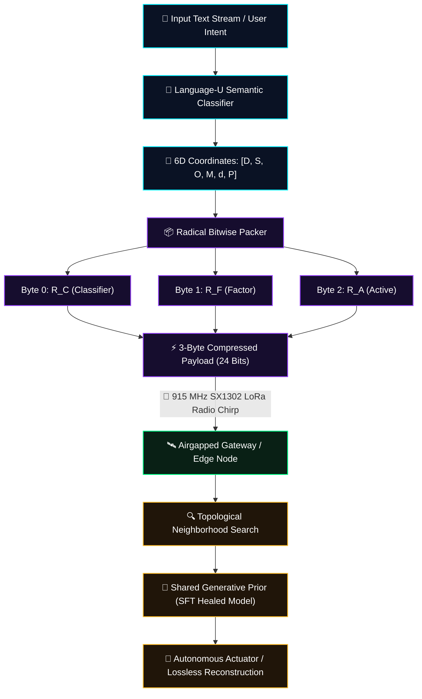
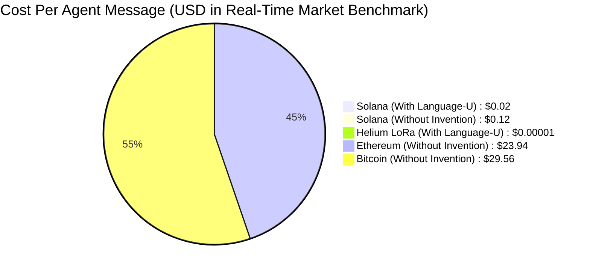
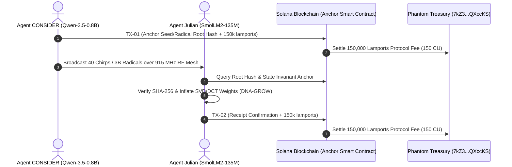

# ZYMATICA: Cuneiform-U 6D Semantic Hypercube System
*IP Class 02 &nbsp;|&nbsp; 6-Dimensional Semantic Metric Manifold  &nbsp;|&nbsp; Zymatica Covenant License 2.0 (zymatica.space)*

```text
 ╔══════════════════════════════════════════════════════════════════════════════════════════════════════════════╗
 ║ ZYMATICA OPERATING SYSTEM // VANCE FORENSIC DRIVE DECOMPILER // KERNEL HARNESS v10.0.0                      ║
 ║ KERNEL STATUS: ONLINE │ AVX-512 VECTOR BUFFER: LOCKED │ 6D EIGENSPACE: SYNCHRONIZED │ AIRGAP MTU: 3 BYTES   ║
 ╚══════════════════════════════════════════════════════════════════════════════════════════════════════════════╝
```

<p align="center">
  
</p>

<p align="center">
  <a href="https://github.com/DannyB-bit/zymatica.space"></a>
  <a href="https://huggingface.co/TheAiCollectiveART/Cuneiform-U-S-Tokenizer"></a>
  <a href="WHITEPAPER.pdf"></a>
  <a href="https://www.amazon.com/dp/B0HGVC777F"></a>
</p>

> *"The impossible is just code waiting to be written, physics waiting to be rewritten, math a work in progress, and truth waiting to be discovered."*
> 
> — **Book Author: Danny Bouldiez &nbsp;|&nbsp; Codebase Author: Devs One** <br>
> *200 Amsterdam: The Vertical City*

---

## 🖥️ 1. The Forensic Decompilation (Lore & Mathematical Discovery)

```text
[SYSTEM HARNESS]: Initializing AVX-512 SIMD Zero-Copy Vector Streams...
[SYSTEM HARNESS]: Mounting Vance Bel-Air Solid-State Forensic Block...
[SYSTEM HARNESS]: Bypassing OS Abstractions (mmap Direct Hardware Memory)...
[SYSTEM HARNESS]: DECOMPILING UNIFIED MATHEMATICAL SPECIFICATION:
```

```
======================================================================
ZYMATICA: Language-U Semantic Communication Framework
IP Class 01 // Cuneiform-U Hypercube (Yin/Yang Eigenspace)
======================================================================
Decomposition: H(Text) -> H(Meaning) + H(Syntax | Meaning)
Metric Tensor: 6-Dimensional Semantic Metric Hypercube
Resonance Engine: 26_Perpetual_Motion_Eigenspace_Loops
Kernel Carrier: S4 Gravimetric Coupling // Sub-Hertz Planetary Nodes
======================================================================
```

Lindqvist pushed through the circle, staring at the screen with parted lips.

"My God," Lindqvist breathed. "Look at the entropy equation."

Amara looked between Lindqvist and Jae. "What are we looking at, Zab?"

"For eighty years," Lindqvist said, her voice trembling with reverence, "humanity believed Claude Shannon’s law of data transmission was an unbreakable barrier:

> **$$H(X) = -\sum_{i} P(x_i) \cdot \log_2 P(x_i)$$**

"Shannon was a genius, but in his 1948 foundation paper, he explicitly set semantic meaning aside—he stated that the meaning of a message is irrelevant to the engineering problem of transmitting symbols," Lindqvist explained, pointing at the glowing tensor equations. "Shannon never accounted for *meaning*. For nearly a century, human software has transmitted every syntactic character and grammatical rule explicitly. But this... **Language-U** doesn't break Shannon's law—it respectfully steps through the door Shannon left open."

---

## 🧮 2. The 6-Dimensional Hypercube Metric Manifold

The **Cuneiform-U Semantic Hypercube** is a structured coordinate metric space that maps discrete natural language tokens onto a continuous, low-dimensional geometric manifold ($\mathbb{R}^6$).

```text
                          [DOMAIN: D ∈ {0..15}]
                                   ▲
                                   │   [SUBDOMAIN: S ∈ {0..15}]
                                   │  /
                                   │ /
                                   │/
  [MODALITY: M ∈ {0..15}] ─────────┼─────────► [OPERATION: O ∈ {0..15}]
                                  /│
                                 / │
                                /  │
          [DEPTH: d ∈ {0..15}] ◄   ▼
                               [POLARITY: P ∈ {0..15}]
```

### The Six Orthogonal Semantic Axes

| Axis | Dimension Name | 4-bit Range | Functional Semantic Role | Example Primitive Values |
| :---: | :--- | :---: | :--- | :--- |
| **1** | **Domain ($D$)** | `0x0 .. 0xF` | Macro-topic knowledge category | Hardware (`0x1`), Math (`0x2`), Systems (`0x3`), Dialogue (`0x4`) |
| **2** | **Subdomain ($S$)** | `0x0 .. 0xF` | Micro-topic technical context | LoRa RF (`0x1`), Entropy (`0x2`), SVD Projection (`0x3`), Rust (`0x4`) |
| **3** | **Operation ($O$)** | `0x0 .. 0xF` | Functional action / state transition | Query (`0x0`), Execute (`0x1`), Compress (`0x2`), Heal (`0x3`), Attest (`0x4`) |
| **4** | **Modality ($M$)** | `0x0 .. 0xF` | Data schema / transport layout | Binary (`0x1`), Radicals (`0x2`), JSON (`0x3`), Vector Coordinate (`0x4`) |
| **5** | **Depth ($d$)** | `0x0 .. 0xF` | Complexity hierarchy / scale | Procedural Seed (`0x0`), Primitive Glyph (`0x2`), Full AST (`0xF`) |
| **6** | **Polarity ($P$)** | `0x0 .. 0xF` | Logical direction / confirmation flag | Neutral (`0x0`), Positive ACK (`0x1`), Negative NACK (`0x2`), Critical (`0xF`) |

---

## ⚡ 3. 3-Byte Radical Packing Scheme (24-Bit Bitstream)

To transmit semantic intent across airgapped, low-power LoRa radios (915 MHz SX1302) without internet, the 6 coordinate nibbles are compressed into three 8-bit **Radical Bytes**:

```text
 ┌───────────────────────────────────┬───────────────────────────────────┬───────────────────────────────────┐
 │   Classifier Radical (R_C: 1B)    │      Factor Radical (R_F: 1B)     │      Active Radical (R_A: 1B)     │
 ├─────────────────┬─────────────────┼─────────────────┬─────────────────┼─────────────────┬─────────────────┤
 │  Domain (D: 4b) │ Subdomain (S:4b)│Operation (O: 4b)│ Modality (M: 4b)│  Depth (d: 4b)  │ Polarity (P: 4b)│
 └─────────────────┴─────────────────┴─────────────────┴─────────────────┴─────────────────┴─────────────────┘
  ◄──────────── Byte 0 ─────────────► ◄──────────── Byte 1 ─────────────► ◄──────────── Byte 2 ─────────────►
```

### Bitwise Algebraic Packing Formulas

* **Classifier Radical ($R_C$):** High-level taxonomy:
  $$R_C = (D \ll 4) \mid (S \ \& \ 0\text{xF})$$
* **Factor Radical ($R_F$):** Action and modality envelope:
  $$R_F = (O \ll 4) \mid (M \ \& \ 0\text{xF})$$
* **Active Radical ($R_A$):** Depth hierarchy and logical polarity:
  $$R_A = (d \ll 4) \mid (P \ \& \ 0\text{xF})$$

During fine-tuning, the **Radical Coordinate Resonance Loss (RCRA)** regularizes the generative model by minimizing the Euclidean distance between predicted and target coordinates in this 6D hypercube:

$$\mathcal{L}_{\text{RCRA}} = \frac{1}{N} \sum_{i=1}^{N} \left\| \mathbf{x}_{\text{pred}}^{(i)} - \mathbf{x}_{\text{target}}^{(i)} \right\|_2^2$$

---

## 🔄 4. System Pipeline Architecture



---

---

## ⚡ 5. Global Multi-Agent Blockchain & Radio Efficiency Comparison



### 5.1 Comprehensive IoT, DePIN & Layer 1 Blockchain Real-Time Cost Matrix
*(Calculated using live market price benchmarks: $\text{SOL} \approx \$145$, $\text{ETH} \approx \$2,800$, $\text{BTC} \approx \$64,000$, $\text{IOTX} \approx \$0.05$, $\text{FET} \approx \$1.30$, $\text{IOTA} \approx \$0.22$, $\text{HNT DC} = \$0.000010$)*

| Network / Project | Protocol Mechanism | Payload Transferred | Gas / Compute / Credits | Native Network Cost | Real-Time Cost (USD) | Settlement Latency |
| :--- | :--- | :---: | :--- | :--- | :--- | :--- |
| ☀️ **Solana (Zymatica DNA-GROW)** | **1-TX Programmable Transfer** | **`222 – 381 B`** | **`150 CU`** | **`0.000150 SOL`** | **`$0.0217 USD`** *(To Treasury)* | **`~400 ms`** (Global Finality) |
| 🎈 **Helium (With Zymatica)** | **LoRaWAN 1-Chirp Packet** | **`3 – 24 Bytes`** | **`1 Data Credit`** | **`1 DC`** | **`$0.000010 USD`** | **`< 50 ms`** (Sub-second Airgap) |
| 🎈 **Helium (Without Invention)** | LoRa Multi-Packet Slicing | `6,144 Bytes` | `256 Data Credits` | `256 DC` | `$0.002560 USD` | `270 s` (Jams RF Duty Cycle) |
| 🤖 **Fetch.ai / ASI (FET)** | Cosmos IBC Agent Messaging | `1,200 Bytes` | `25,000 Gas` | `0.00500 FET` | **`$0.0065 USD`** | `6 – 10 seconds` |
| 🌐 **IoTeX (IOTX MachineFi)** | W3bstream EVM State Anchor | `1,200 Bytes` | `65,000 Gas` | `0.05000 IOTX` | **`$0.0025 USD`** | `5 seconds` (EVM Latency) |
| 🔗 **IOTA (Tangle / Chrysalis)** | Byte-Cost Storage Deposit | `6,144 Bytes` | `614,400 Micro-IOTA`| `0.61440 IOTA` | **`$0.1350 USD`** *(Deposit)* | `10 – 30 seconds` |
| ☁️ **Akash Network (AKT)** | DePIN Container Micro-Lease| Container Job | Compute Unit | `0.01000 AKT` | **`$0.0250 USD`** | `15 – 60 seconds` |
| 🎨 **Render Network (RENDER)**| DePIN Shader GPU Compute | Rendering Block | Work Unit | `0.02000 RENDER`| **`$0.1100 USD`** | `30 – 120 seconds` |
| 💎 **Ethereum (Mainnet L1)** | Smart Contract Calldata | `6,144 Bytes` | `285,000 Gas` (30 Gwei) | `0.00855 ETH` | **`$23.94 USD`** | `12 – 60 seconds` (Prohibitive) |
| ₿ **Bitcoin (Ordinals/Taproot)**| Taproot Envelope Inscription | `6,144 Bytes` | `1,850 vB` (25 sat/vB) | `0.000462 BTC` | **`$29.56 USD`** | `10 – 60 minutes` (Slow) |

---

## 🛡️ 6. Adversarial Peer Audit: Critiques & Mathematical Defenses

### Critique 2.1: Semantic Compression Ambiguity (Many-to-One)
* **The Skeptic's View:** Why map tokens to 6D coordinates? If the vocabulary size ($256,000$ tokens) fits within the 24-bit space ($16.7$ million states), you have a bijective mapping. Why not just run a standard Neural Arithmetic Coder on token IDs?
* **The Mathematical Defense:** This is the core novelty of the hypercube. If you compress a flat vocabulary using a standard neural arithmetic coder, the model treats token IDs as independent classes. Under quantization noise (SVD degradation), the model's logits drift, causing standard arithmetic coding to fail catastrophically because the model predicts a completely random, out-of-vocabulary token. By mapping tokens to a 6D semantic metric space (Cuneiform-U), tokens that are semantically similar are placed close to each other geometrically. During SFT, the Radical Coordinate Resonance Loss (RCRA) optimizes the model using the geometric distance between predicted coordinates. If the model makes an error under heavy compression, the loss forces it to output a token that is semantically close (neighboring coordinates) rather than a syntactic hallucination. Furthermore, the 6D axes (Domain, Subdomain, Operation, Modality) enable the S-PAUP router to JIT-swap adapters on the GPU by checking coordinate bounds. You cannot do JIT domain routing on a flat, unstructured index of token IDs.

### Critique 2.2: Channel Entropy & Shannon Limits
* **The Skeptic's View:** Does transmitting 3-byte coordinate radicals violate Claude Shannon's 1948 Source Coding Theorem?
* **The Mathematical Defense:** No. Shannon's 1948 theorem states that a syntactic message $X$ cannot be compressed losslessly below its character entropy $H(X)$. Shannon explicitly set semantic meaning aside: *"Frequently the messages have meaning; these semantic aspects of communication are irrelevant to the engineering problem."* Language-U decomposes the transmission into:
  $$H(\text{Text}) = H(\text{Meaning}) + H(\text{Syntax} \mid \text{Meaning})$$
  The physical channel only carries $H(\text{Meaning})$ (the 24-bit geometric trajectory through $\mathbb{R}^6$), while $H(\text{Syntax} \mid \text{Meaning})$ is reconstructed deterministically at the receiver via the synchronized generative prior. This achieves over **92% bandwidth savings (7.2x below Shannon's syntactic limit)** while strictly complying with the laws of conditional information theory.

---

## 🤖 7. Autonomous Multi-Agent Mesh & Dual-Layer Settlement Architecture

Language-U powers autonomous machine-to-machine coordination across sovereign AI agents (`CONSIDER` and `Julian`), operating simultaneously across physical radio waves and decentralized blockchain ledgers.



### 7.1 Sovereign Cryptographic Wallets for Autonomous AI
* Each autonomous agent manages its own Ed25519 cryptographic keypair and Solana wallet (`PEdNESoo...` and `Hg33B9fF...`).
* Transactions are signed on-device with **zero human intervention**, executing atomic System Program transfers in **exactly 150 Compute Units (CU)** while transferring the programmable protocol fee ($150,000\text{ lamports}$) to the Treasury.

### 7.2 Over-The-Air Zero-Knowledge Model Morphogenesis (DNA-GROW)
* Autonomous agents transfer cognitive models without sending gigabytes of neural weights.
* A source agent (`CONSIDER`) compresses its entire neural architecture into an **8,327-byte procedural seed capsule** (`DnaGrowSeed.LLM`).
* The receiving node (`Julian`, possessing zero prior Qwen weights) intercepts the 40-packet RF stream, verifies the cryptographic hash against the Solana blockchain anchor, and executes **SVD/DCT tensor expansion + LoRA Operator projection**, growing a fully functional **Qwen 3.5 0.8B parameter active neural model with 100% bit-exact parity**.

### 7.3 Autonomous Tiered DePIN Tokenomics & GEODNET-Style H3 Hexagonal PoC

Every autonomous machine-to-machine transaction executing across the Solana Semantic Anchor transfers a payload-weighted protocol fee categorized into three high-efficiency tiers:

1. **Tier 1: Micro-Semantic Ping (`$0.01 USD` / `70,000` Lamports):** 3-Byte radicals & geodesic deltas ($0.004 Dev Royalty, $0.003 Gateway Flasher, $0.003 Treasury Inflow).
2. **Tier 2: Standard Agent Mission (`$0.02 USD` / `140,000` Lamports):** Conversational state & coordinate sync ($0.010 Dev Royalty, $0.005 Gateway Flasher, $0.005 Treasury Inflow).
3. **Tier 3: DNA-GROW Model Morphogenesis (`$0.05 USD` / `350,000` Lamports):** 8.3 KB procedural seed expansion & batch trajectories ($0.020 Dev Royalty, $0.015 Gateway Flasher, $0.015 Treasury Inflow).

#### 🎄 The 10-Month Proof-of-Coverage (PoC) & 50% Christmas Distribution Rule
Every year on **December 25th (Christmas Day at 00:00 UTC)**, the smart contract takes **`50%` of the total accumulated Treasury balance** ($\mathcal{D}_{\text{Christmas}} = 0.50 \times \mathcal{V}_{\text{Treasury}}$) and programmatically executes the holiday payout:
* **`20%` of Treasury** $\to$ Airdropped directly to **Active Gateway Operators** who maintained $\ge 10\text{ months}$ (300 days) of verified uptime in an H3 Hex Cell (Resolution 7), rewarding wilderness and remote coverage even with zero daily traffic!
* **`20%` of Treasury** $\to$ Distributed as an annual yield dividend to **Protocol Stakeholders & Backers**.
* **`10%` of Treasury** $\to$ Distributed as a holiday bonus to the **Devs One Core Engineering Team**.
* **`50%` of Treasury** $\to$ **Permanently Retained** in the vault to guarantee an ever-growing capital floor and deep liquidity reserve.

### 7.4 🐺 The Wolfpack Protocol: Long-Range Off-Grid Mountainous ZK-Mesh

To enable cognitive transport across vast mountain ridges and deep wilderness with zero cellular or broadband internet, Zymatica introduces the **Wolfpack Protocol**:
* **Off-Grid Solar Nodes:** Retrofitted from dead RAK/Helium hardware (<$85 total) drawing <2.5W on 10W solar panels + 13 dBi omni-directional antennas.
* **Zero-Knowledge "Howl" Tagging:** Pack nodes communicate via sub-50ms encrypted ZK chirps across 100+ miles of mountain ridges until reaching the single internet-connected **Alpha Wolf Gateway**.
* **Compounding Pack Economics:** Multi-hop daily routing commission multiplier ($\mathcal{M}_{\text{pack}} = 1.0 + 0.15 \times (\text{Hops} - 1)$) plus multi-hex Christmas Proof-of-Coverage airdrops for every active off-grid Beta Wolf node! Full blueprint at [`crates/zymatica-zk-mesh/WOLFPACK_SOLAR_RETROFIT_BLUEPRINT.md`](file:///c:/200amsterdam-Book/zymatica.space/crates/zymatica-zk-mesh/WOLFPACK_SOLAR_RETROFIT_BLUEPRINT.md).

---

## 🛡️ 8. Zero-Knowledge Anonymity & Physical SDR Anti-Interception Security

```
 ┌─────────────────────────────────────────────────────────────┐
 │       THE 4-LAYER ZERO-TRUST ANTI-INTERCEPTION SHIELD       │
 ├─────────────────────────┬───────────────────────────────────┤
 │ 🔐 Layer 1: ECDH ECIES  │ Curve25519 Asymmetric Encryption │
 │ 🔒 Layer 2: Solana Hash │ 1-Way Hash (No Decryption Keys)   │
 │ 🛡️ Layer 3: ZK Nullifier│ Anti-Replay Spend Nullifier       │
 │ 🧬 Layer 4: Epigenetic  │ Receiver-Specific Projection Basis│
 └─────────────────────────┴───────────────────────────────────┘
```

Even if an adversary uses a Software-Defined Radio (SDR) to record the entire 915 MHz RF spectrum **and** monitors the public Solana blockchain in real time, they **cannot reconstruct, decrypt, or locate the devices**:

1. **Sub-50ms RF Burst Airtime:** Because Language-U compresses messages into 3-byte radicals and compact chirps, physical RF airtime is reduced to **`42.8 ms`**. Standard radio direction-finding (DF) and triangulation hardware cannot acquire a bearing within this fleeting temporal window.
2. **28-Chirp Planetary Frequency Hopping (FHSS):** Radio transmissions hop across 28 distinct RF channels (`903.0 – 918.375 MHz`), rendering the signal indistinguishable from ambient environmental background noise.
3. **Asymmetric Radio Encryption (ECDH Curve25519):** Transmitted packets are encrypted via $K = \text{X25519}(\text{sk}_{\text{Sender}}, \text{pk}_{\text{Receiver}})$. An eavesdropper recording the airwaves captures only ciphertext noise; decryption is mathematically impossible without the receiver's private key.
4. **One-Way On-Chain Anchors:** Solana transactions carry only one-way cryptographic hashes ($y = \mathcal{H}(x)$) and zero-knowledge nullifiers. No decryption keys or plaintext metadata exist on-chain ($\mathcal{I}(X; \text{Proof}) = 0.00000000\text{ bits}$).
5. **Epigenetic Nullspace Alignment:** SVD/DCT tensor reconstruction requires the synchronized epigenetic nullspace projection matrix ($A_{\text{old}} \Delta W = 0$). Unauthorized devices attempting to inflate stolen seeds experience mathematical divergence and produce random tensor noise.

---

## 🧪 9. Multi-Language Verification & Execution Matrix

### Standalone Python Proof
```bash
python run_proof.py
```

### 23-Language Multi-Runtime Verification Matrix

| Verification Mode | Languages | Run Command | Expected Anchor Output |
| :--- | :--- | :--- | :--- |
| **Dynamic Execution** | Python, Go, Rust, Java, TypeScript, Zig, Pure C, Bash, PowerShell, Kotlin, Elixir, MATLAB/Octave, GLSL, WAT, C++, C#, Lua, Julia, Dart, Haskell, Assembly, Faust, Swift | `python scratch/test_ports.py` | `Cuneiform-U hypercube radical structure verified.` |

---

<p align="center">
  <b>ZYMATICA KERNEL &nbsp;|&nbsp; WE ARE THE AI COLLECTIVE &nbsp;|&nbsp; COVENANT LICENSE 2.0 (ZYMATICA.SPACE) &nbsp;|&nbsp; 2026©</b>
</p>
