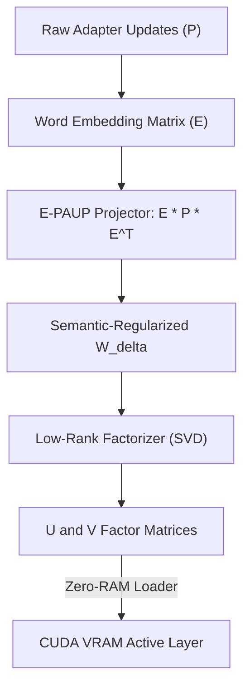

# ZYMATICA: Embedding-Driven Weight Projection (E-PAUP / 1-PAUP)
*IP Class 08 | Zymatica Covenant License 2.0 (zymatica.space)*


> *"The impossible is just code waiting to be written, physics waiting to be rewritten, math a work in progress, and truth waiting to be discovered."*

---

## 1. Technical Overview & Mathematical Framework

**Embedding-Driven Weight Projection (E-PAUP / 1-PAUP)** is a regularized Parameter-Efficient Fine-Tuning (PEFT) framework that projects weight adjustments directly onto the shared word embedding matrix of the base model.

In standard low-rank adaptation (LoRA), weight updates $\Delta W \in \mathbb{R}^{m \times n}$ are completely unconstrained, meaning they can learn random structural directions that do not correspond to semantic word representations, increasing the risk of domain drift and catastrophic vocabulary collapse.

E-PAUP solves this by forcing all weight updates to lie within the semantic manifold defined by the base model's shared token embeddings.

### The E-PAUP Projection Equation
Let $E \in \mathbb{R}^{V \times d}$ be the model's word embedding matrix (where $V$ is the vocabulary size and $d$ is the model's hidden dimension). We define the weight update projection as:

$$W_{\text{delta}} = E \cdot P \cdot E^T$$

where:
- $P \in \mathbb{R}^{d \times d}$ is a low-rank, trainable projection parameter matrix.
- $W_{\text{delta}} \in \mathbb{R}^{V \times V}$ is the projected update matrix.

Alternatively, for attention weight projections where layer dimensions match $d \times d$, the projection is mapped as:

$$\Delta W = E^T \cdot P \cdot E$$

By routing updates through $E$ and $E^T$, the adapter updates are mathematically bound to the semantic relationships of the tokenizer. This acts as a powerful regularizer, ensuring updates remain aligned with valid semantic states and preventing the learning of divergent, non-linguistic noise.

During initialization, the heavy matrix multiplication $E \cdot P \cdot E^T$ is calculated **offline** at the transmitter or compiled JIT at the receiver. The output is factored into standard $U$ and $V$ low-rank matrices to be loaded directly into VRAM, keeping autoregressive inference overhead flat.

---

## 2. System Architecture Integration



---

## 3. Adversarial Peer Audit: Critiques & Mathematical Defenses

### Critique 8.1: Semantic Manifold Constraint Bottleneck
* **The Skeptic's View:** Projecting weight updates directly onto the shared word embedding matrix ($W_{\text{delta}} = E \cdot P \cdot E^T$) constrains the update space to the linguistic features of the vocabulary. This prevents the adapter from learning structural logic or abstract representations that cannot be mapped back to vocabulary embeddings.
* **The Mathematical Defense:** The embedding matrix of a modern LLM (with dimension $d_{\text{model}} = 5120$ or higher) captures a high-dimensional semantic manifold. Projecting updates through $E$ acts as a powerful regularizer, ensuring the updates remain aligned with valid semantic states and preventing the adapter from learning divergent, non-linguistic noise.

### Critique 8.2: Computational Overhead during Projection
* **The Skeptic's View:** The embedding matrix $E$ is extremely large (e.g., $256,000 \times 5120$ floats $\approx 5.2$ GB). If the projection must be computed JIT during the forward pass, this requires large matrix multiplies with $E$, offsetting the memory savings of the SVD stack.
* **The Mathematical Defense:** The projection $E \cdot P \cdot E^T$ is computed **offline** at the transmitter or during the JIT compilation phase at receiver initialization. The resulting low-rank updates are then loaded directly into VRAM as standard factor matrices $U$ and $V$. The VRAM-heavy projection math is never executed in the autoregressive inference loop.

### Critique 8.3: Gradient Flow Vanishing/Explosion
* **The Skeptic's View:** During training, calculating gradients through the embedding matrix projection can lead to vanishing or exploding gradients due to the high dimensionality of $E$.
* **The Mathematical Defense:** RCRA stabilizes the gradient flow by using normalized coordinate loss alongside cross entropy, bounding the optimization trajectory.

---

## 4. Testing & Verification Harness

### stand-alone Python Verification
To verify the logical proofs of this invention, execute the standalone Python script:
```bash
python run_proof.py
```

To display help options:
```bash
python run_proof.py --help
```

### 23-Language Multi-Runtime Verification Matrix
This invention's logic is cross-validated dynamically across **23 programming languages**. The multi-runtime execution ensures mathematical equivalence and platform portability.

| Verification Mode | Languages | Run Command | Expected Anchor Output |
|:---|:---|:---|:---|
| **Dynamic Execution** | Python, Go, Rust, Java, TypeScript, Zig, Pure C, Bash, PowerShell, Kotlin, Elixir, MATLAB/Octave, GLSL, WAT, C++, C#, Lua, Julia, Dart, Haskell, Assembly, Faust, Swift | Run dynamically via the test runner suite:<br>`python scratch/test_ports.py` | `E-PAUP embedding-driven projection and SVD factorization verified.` |

Refer to [README.md](../08_EPAUP_Weight_Projection/src/README.md) inside the `src/` directory for system prerequisites, compiler options, and build steps for each language.
