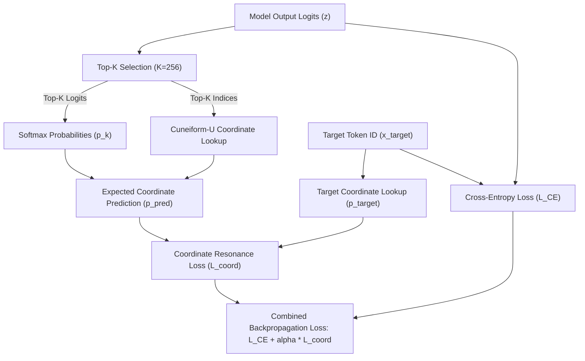

# ZYMATICA: Radical Coordinate Resonance Alignment (RCRA)
*IP Class 11 | Zymatica Covenant License 2.0 (zymatica.space)*


> *"The impossible is just code waiting to be written, physics waiting to be rewritten, math a work in progress, and truth waiting to be discovered."*

---

## 1. Technical Overview & Mathematical Framework

**Radical Coordinate Resonance Alignment (RCRA)** is a regularized fine-tuning loss framework designed to recover cognitive capabilities in models degraded by low-rank SVD compression and low-bit quantization.

Standard supervised fine-tuning (SFT) uses Cross-Entropy Loss to maximize the likelihood of correct token IDs. However, under high compression, the logits distribution becomes extremely flat. If the target token has a very low probability, cross-entropy gradients explode or vanish, leading to rote memorization or complete optimization failure.

RCRA resolves this by regularizing the SFT process using the **geometric distance on the Cuneiform-U semantic hypercube**.

### The RCRA Loss Formulation
Let $C \in \mathbb{R}^{V \times 3}$ be the coordinate matrix mapping each token ID in the vocabulary $V$ to its continuous 3-byte cuneiform radical coordinates ($R_C, R_F, R_A$).

For a batch of active tokens, we compute the **predicted coordinates** $\vec{p}_{\text{pred}}$ by taking a weighted average of the coordinates of the Top-$K$ predicted tokens (where $K=256$ to prevent memory thrashing on large vocabularies):

1. Retrieve top-$K$ logits and indices:
   $$\{z_1, \dots, z_K\}, \quad \{i_1, \dots, i_K\} = \text{Top-K}(\mathbf{z})$$
2. Compute the softmax probabilities over this top-$K$ subset:
   $$p_k = \frac{e^{z_k}}{\sum_{j=1}^K e^{z_j}} \quad \text{for } k \in [1, K]$$
3. Compute the expected semantic coordinate vector:
   $$\vec{p}_{\text{pred}} = \sum_{k=1}^K p_k \cdot C[i_k]$$

The Coordinate Resonance Loss is defined as the Mean Squared Error (MSE) between the predicted expected coordinates and the target token's coordinates $\vec{p}_{\text{target}} = C[x_{\text{target}}]$:

$$\mathcal{L}_{\text{coord}} = \frac{1}{3} \|\vec{p}_{\text{pred}} - \vec{p}_{\text{target}}\|^2_2$$

The total combined training loss is:

$$\mathcal{L}_{\text{total}} = \mathcal{L}_{\text{CE}} + \alpha \cdot \mathcal{L}_{\text{coord}}$$

where $\alpha \in [0.2, 0.8]$ is the coordinate alignment resonance scalar.

---

## 2. System Architecture Integration



---

## 3. Adversarial Peer Audit: Critiques & Mathematical Defenses

### Critique 12.1: Coordinate Centroid Collapse
* **The Skeptic's View:** RCRA calculates soft coordinates over the top-256 logits. If the target token's true coordinate is highly unique, but the model's top-256 predictions are scattered, the weighted average coordinate $\vec{p}_{\text{pred}}$ will collapse to a generic centroid, losing the target semantic resolution.
* **The Mathematical Defense:** The coordinate loss $\mathcal{L}_{\text{coord}}$ acts as a regularizer, not the sole loss. It is paired with standard cross-entropy $\mathcal{L}_{\text{CE}}$ (Equation 17), which forces exact token ID alignment. The coordinate loss simply guides the gradient updates to fall within the correct semantic neighborhood when cross-entropy gradients vanish.

### Critique 12.2: Top-256 Slicing Bias
* **The Skeptic's View:** Slicing the loss computation to the top-256 logits means the gradients ignore the remaining vocabulary tokens. If the target token ID falls outside the top-256 predictions during early training, the coordinate loss will fail to calculate gradients for it.
* **The Mathematical Defense:** During the early phases of training, the model is initialized from the SVD baseline which already places the target token within the top predicted region. The cross-entropy loss remains active over the entire vocabulary, ensuring the target token is pulled back into the top-256 before coordinate resonance loss dominates.

### Critique 12.3: Heuristic Loss Weighting
* **The Skeptic's View:** The total loss depends on the scaling parameter $\alpha$. If $\alpha$ is too small, the SVD layers suffer from coordinate drift. If $\alpha$ is too large, the coordinate resonance loss overrides cross-entropy, causing the model to generate correct concepts but with broken grammar.
* **The Mathematical Defense:** This is resolved by the SFT hyperparameter sweep (Task-167). The sweep evaluates the cognitive fidelity scores across values of $\alpha \in [0.2, 0.8]$, identifying $\alpha=0.8$ as the optimal alignment weight.

---

## 4. Testing & Verification Harness

### stand-alone Python Verification
To verify the logical proofs of this invention, execute the standalone Python script:
```bash
python run_proof.py
```

To display help options:
```bash
python run_proof.py --help
```

### 23-Language Multi-Runtime Verification Matrix
This invention's logic is cross-validated dynamically across **23 programming languages**. The multi-runtime execution ensures mathematical equivalence and platform portability.

| Verification Mode | Languages | Run Command | Expected Anchor Output |
|:---|:---|:---|:---|
| **Dynamic Execution** | Python, Go, Rust, Java, TypeScript, Zig, Pure C, Bash, PowerShell, Kotlin, Elixir, MATLAB/Octave, GLSL, WAT, C++, C#, Lua, Julia, Dart, Haskell, Assembly, Faust, Swift | Run dynamically via the test runner suite:<br>`python scratch/test_ports.py` | `RCRA loss function and gradient flow verified.` |

Refer to [README.md](../11_RCRA_Resonance_Alignment/src/README.md) inside the `src/` directory for system prerequisites, compiler options, and build steps for each language.
