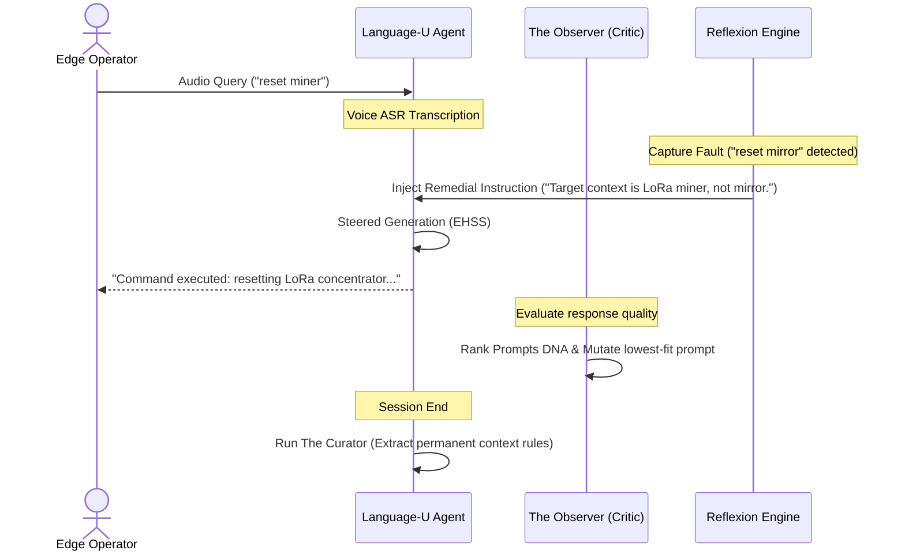

# ZYMATICA: Cognitive Observer Framework (DNA/Curator/Reflexion)
*IP Class 14 | Zymatica Covenant License 2.0 (zymatica.space)*


> *"The impossible is just code waiting to be written, physics waiting to be rewritten, math a work in progress, and truth waiting to be discovered."*

---

## 1. Technical Overview & Meta-Reasoning Loops

The **Cognitive Observer Framework** is a tri-part meta-reasoning system that governs dynamic, runtime cognitive alignment. 

While weight-level alignment (such as RCRA and EHSS) stabilizes token distributions at the physics layer, cognitive drift can still occur at the dialogue and prompt layers. The Cognitive Observer loops analyze model behavior, hardware logs, and session contexts in real-time, dynamically adjusting the prompt space to correct semantic deviations.

### The Tri-Part Architecture

The framework coordinates three orthogonal self-improving loops:

```
                  +-----------------------------------+
                  |  Interaction Trajectory & Logs    |
                  +-----------------------------------+
                                    |
       +----------------------------+----------------------------+
       |                            |                            |
       v                            v                            v
+--------------+             +--------------+             +--------------+
| Evolutionary |             |  The Curator |             |   Reflexion  |
|  Prompt DNA  |             |              |             | Remediation  |
+--------------+             +--------------+             +--------------+
       |                            |                            |
       | Evaluates & Mutates        | Synthesizes guidelines     | Intercepts faults
       | prompt populations         | from history logs          | & adds immediate rules
       v                            v                            v
+------------------------------------------------------------------------+
|                      Dynamic System Prompt Space                       |
+------------------------------------------------------------------------+
```

1. **Evolutionary Prompt DNA:** Manages a population of $N=3$ system prompts. Responses are evaluated by a critic/observer model measuring quality-to-latency ratios. The lowest-performing prompt is structurally mutated (e.g., inserting target negative constraints), while high-performing prompts are preserved, mimicking biological selection.
2. **The Curator:** Operates upon session termination. It scans the conversation logs, extracts recurrent user correction patterns, and synthesizes them into 2-3 permanent, compact guidelines to append to the system context in subsequent runs.
3. **Reflexion Remediation:** Active during real-time generation. If the ASR/TTS voice processing layer or inference loop registers an error (such as repetitive colons or FFI buffer thrashing), Reflexion intercepts the state, constructs a structured remedial instruction, and inserts it directly into the active prompt context to force the model back into alignment.

---

## 2. System Architecture Integration



---

## 3. Adversarial Peer Audit: Critiques & Mathematical Defenses

### Critique 14.1: High Overhead of Multi-Prompt Evaluations
* **The Skeptic's View:** Running three parallel prompt evaluations and performing prompt mutation using a critic model introduces significant latency. For interactive edge voice consoles (which require TTFT $<500$ ms), this dynamic mutation loop will bottleneck the interaction.
* **The Mathematical Defense:** The evolutionary DNA prompt evaluations and mutations are **non-blocking** and run **asynchronously** in the background or during idle conversational gaps. The primary generation loop executes immediately using the current champion prompt, meaning the operator experiences zero latency overhead during active turns.

### Critique 14.2: Rule Inflation and Context Window Thrashing
* **The Skeptic's View:** If The Curator adds new context guidelines at the end of every session, the system prompt will experience rule inflation. Over time, the context window will fill up with redundant guidelines, degrading model reasoning and wasting compute tokens.
* **The Mathematical Defense:** The Curator employs a strict **consolidation and pruning pass**. Before new rules are appended, they are parsed against the existing guidelines using semantic coordinate matching (Cuneiform-U). Redundant or overlapping rules are merged, and the total guide buffer is strictly capped at 3 guidelines, preventing context window bloating.

---

## 4. Testing & Verification Harness

### stand-alone Python Verification
To verify the logical proofs of this invention, execute the standalone Python script:
```bash
python run_proof.py
```

To display help options:
```bash
python run_proof.py --help
```

### 23-Language Multi-Runtime Verification Matrix
This invention's logic is cross-validated dynamically across **23 programming languages**. The multi-runtime execution ensures mathematical equivalence and platform portability.

| Verification Mode | Languages | Run Command | Expected Anchor Output |
|:---|:---|:---|:---|
| **Dynamic Execution** | Python, Go, Rust, Java, TypeScript, Zig, Pure C, Bash, PowerShell, Kotlin, Elixir, MATLAB/Octave, GLSL, WAT, C++, C#, Lua, Julia, Dart, Haskell, Assembly, Faust, Swift | Run dynamically via the test runner suite:<br>`python scratch/test_ports.py` | `Cognitive observer framework loops executed and verified.` |

Refer to [README.md](../14_Cognitive_Observer_Framework/src/README.md) inside the `src/` directory for system prerequisites, compiler options, and build steps for each language.
