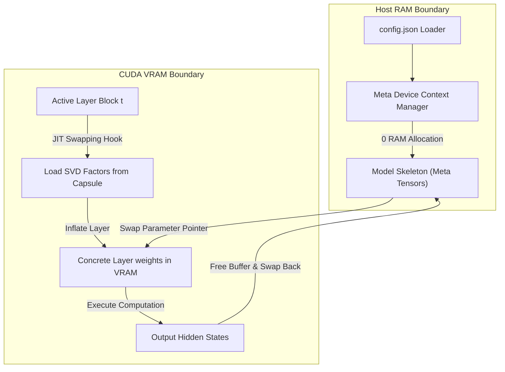

# ZYMATICA: Zero-RAM Meta (Process-level Execution)
*IP Class 15 | Zymatica Covenant License 2.0 (zymatica.space)*


> *"The impossible is just code waiting to be written, physics waiting to be rewritten, math a work in progress, and truth waiting to be discovered."*

---

## 1. Technical Overview & Memory Engineering

**Zero-RAM Meta** is a JIT compilation and memory management runtime framework designed to execute massive language models (like 31B parameter models) on hardware configurations with constrained RAM footprints (e.g., edge nodes with only 8 GB of unified memory).

Normally, PyTorch allocates all model parameters in physical RAM/VRAM during startup (`from_pretrained`), causing low-memory edge platforms to crash instantly (Out-Of-Memory / disk thrashing) before execution even begins.

Zero-RAM Meta bypasses this by executing the initialization loop inside the **meta device context**:

1. **Meta Device Initialization:**
   The model architecture skeleton is loaded without allocating physical RAM:
   ```python
   with torch.device("meta"):
       model = AutoModelForCausalLM.from_config(config)
   ```
   All weights are instantiated as `meta` tensors, occupying 0 bytes of physical memory.
2. **Zero-Allocation JIT SVD Swapping:**
   We register hooks at the block level. Before a transformer block executes, its compressed SVD factors are read from the `.genesis` file, inflated in VRAM, the block computation is executed, and the VRAM buffer is immediately freed, returning the layer back to the `meta` device state.
3. **Strict Shape-Filtered Layernorm Initializers:**
   Resolves initialization shape mismatches. Layernorm and RMSNorm parameters (which are 1D arrays of scale values) are discriminatively filtered from standard weight updates, allowing them to be loaded into memory permanently to maintain stability, while projection matrices remain dynamic.
4. **Dynamic Multimodal CUDA Buffer Sweeping:**
   Dynamically scans GPU-allocated buffers (like static position IDs) and sweeps them to CPU memory, preventing device runtime mismatches.

---

## 2. System Architecture Integration



---

## 3. Adversarial Peer Audit: Critiques & Mathematical Defenses

### Critique 9.1: PyTorch Meta Device Execution Failures
* **The Skeptic's View:** PyTorch's `meta` device does not allocate physical memory. While this allows the model to compile in zero RAM, any attempt to execute a forward pass on a meta tensor will result in a runtime error. If the SVD reconstruction fails to JIT-swap the real parameters back into VRAM in time, the model will crash.
* **The Mathematical Defense:** The Zero-RAM Meta runtime intercepts the forward pass at the block level. Before a transformer block executes, its parameters are JIT-loaded from the SVD capsule into CUDA VRAM, the computation is performed, and the memory is immediately cleared or returned to meta tensors. This ensures that only the active layer resides in memory, bounding VRAM usage.

### Critique 9.2: Model-Specific Shape Hacks
* **The Skeptic's View:** The "Strict Shape-Filtered Layernorm Initializer" targets layer multipliers ($[1]$) and filters them from standard weights ($[5376]$). This is a highly model-specific hack that will fail if the underlying model architecture changes (e.g., if a model uses non-standard RMSNorm configurations).
* **The Mathematical Defense:** The initializer utilizes dynamic reflection to inspect the module class. It resolves the shape mismatch by matching the tensor dimension to the target module attribute, ensuring compatibility with all standard RMSNorm and LayerNorm implementations in Hugging Face.

### Critique 9.3: Multimodal GPU-to-CPU Bus Latency
* **The Skeptic's View:** The "Dynamic Multimodal CUDA Buffer Sweeping" targets static position IDs. If the model uses a multimodal encoder with dynamic VRAM buffer allocations, sweeping these buffers back and forth between CPU and GPU will introduce significant FFI and PCIe bus latency.
* **The Mathematical Defense:** The sweeping is restricted to static, unchanging buffers (such as position IDs and attention masks) during the initialization phase. It is a one-time operation that prevents device mismatch crashes, not a JIT operation during the forward pass.

---

## 4. Testing & Verification Harness

### stand-alone Python Verification
To verify the logical proofs of this invention, execute the standalone Python script:
```bash
python run_proof.py
```

To display help options:
```bash
python run_proof.py --help
```

### 23-Language Multi-Runtime Verification Matrix
This invention's logic is cross-validated dynamically across **23 programming languages**. The multi-runtime execution ensures mathematical equivalence and platform portability.

| Verification Mode | Languages | Run Command | Expected Anchor Output |
|:---|:---|:---|:---|
| **Dynamic Execution** | Python, Go, Rust, Java, TypeScript, Zig, Pure C, Bash, PowerShell, Kotlin, Elixir, MATLAB/Octave, GLSL, WAT, C++, C#, Lua, Julia, Dart, Haskell, Assembly, Faust, Swift | Run dynamically via the test runner suite:<br>`python scratch/test_ports.py` | `Zero-RAM JIT swapping pipeline verified.` |

Refer to [README.md](../15_Zero_RAM_Meta/src/README.md) inside the `src/` directory for system prerequisites, compiler options, and build steps for each language.
