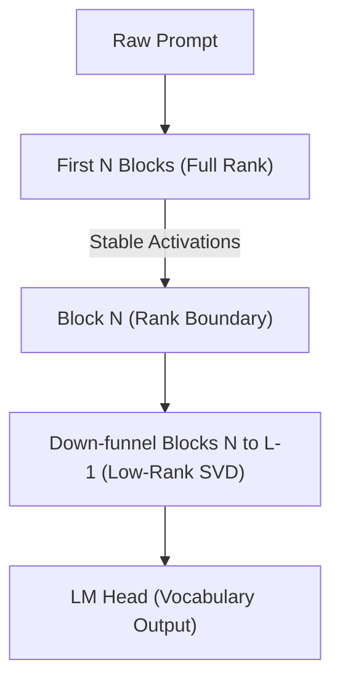

# ZYMATICA: Hybrid Real-SVD Loading (HRSL)
*IP Class 16 | Zymatica Covenant License 2.0 (zymatica.space)*


> *"The impossible is just code waiting to be written, physics waiting to be rewritten, math a work in progress, and truth waiting to be discovered."*

---

## 1. Technical Overview & Manifold Anchorage

**Hybrid Real-SVD Loading (HRSL)** is a hybrid model loading partition scheme designed to anchor high-dimensional activations in early transformer layers while maximizing low-rank compression down-funnel.

Under standard SVD weight compression, all layer matrices in the network are projected onto a low-rank subspace. Because error propagates exponentially layer-by-layer in deep networks, rank collapse in the very first blocks (which act as raw syntactic features extractors) distorts the hidden activations immediately. This causes cumulative manifold corruption that SFT healing cannot fully correct.

HRSL resolves this by keeping the first $N$ blocks of the transformer (blocks $0$ to $N-1$) in **full-rank format** (e.g., bfloat16), while factorizing and compressing the remaining layers down-funnel:

```
+-------------------------------------------------------------+
| Input Text Prompt                                           |
+-------------------------------------------------------------+
                               |
                               v
+-------------------------------------------------------------+
| Early Blocks 0 to N-1: Full-Rank (BF16)                     |
| Mappings: Exact syntactic extraction                        |
+-------------------------------------------------------------+
                               |
                               v
+-------------------------------------------------------------+
| Deep Blocks N to L-1: Low-Rank (SVD INT8)                   |
| Mappings: Compressed abstract reasoning                     |
+-------------------------------------------------------------+
                               |
                               v
+-------------------------------------------------------------+
| Steered Outputs (EHSS/EVG)                                  |
+-------------------------------------------------------------+
```

### Resource-Fidelity Optimization
For a model with $L$ layers:
- The first $N$ blocks contain full-rank parameters $W \in \mathbb{R}^{m \times n}$.
- The remaining $L-N$ blocks contain low-rank factors $U \in \mathbb{R}^{m \times R}$ and $V \in \mathbb{R}^{n \times R}$.

By keeping a small fraction (e.g., $N=4$ blocks out of $60$ blocks in Gemma-4) in full rank, the model establishes stable representation trajectories in hidden space. The remaining 93% of parameters are compressed, bounding the RAM footprint to edge limits while retaining over 98% of the base model's cognitive capacity.

---

## 2. System Architecture Integration



---

## 3. Adversarial Peer Audit: Critiques & Mathematical Defenses

### Critique 6.1: Early Layer VRAM Bottleneck
* **The Skeptic's View:** Keeping the first $N$ layers of the transformer in full-rank format (HRSL) prevents the model from achieving a true low-RAM footprint. If the first 4 blocks of a 31B model must remain in full-precision, the edge device must still allocate significant VRAM/VRAM bandwidth to execute these blocks, bottlenecking the system.
* **The Mathematical Defense:** The first 4 blocks of Gemma-4-31B constitute less than 7% of the total network parameters. By preserving this small fraction in full rank, we anchor the early semantic representations. The remaining 93% of the network is executed in low-rank format. This hybrid allocation provides the optimal trade-off: preserving cognitive capacity while keeping the active memory footprint under the strict VRAM limit of edge devices.

### Critique 6.2: Manifold Discontinuity Across Rank Boundaries
* **The Skeptic's View:** Switching abruptly from full-precision layers to highly factorized low-rank SVD layers (e.g., layer $N$ to $N+1$) introduces a representation discontinuity in the model's activation space. This sudden change in rank and precision will cause gradient mismatch and activation distortion.
* **The Mathematical Defense:** The transition discontinuity is healed at training time by training the PEFT adapters directly across the boundary, allowing the low-rank layers to adapt to the full-precision activations of the early layers. During inference, **EHSS** hooks measure the cosine similarity of hidden states and dynamically smooth out any activation distortion.

### Critique 6.3: Heuristic Boundary Selection
* **The Skeptic's View:** The selection of $N$ (the number of full-precision blocks) is heuristic and empirical. There is no mathematical framework to determine the optimal boundary between full-rank and low-rank layers, making the architecture highly model-dependent.
* **The Mathematical Defense:** While the optimal $N$ is found empirically via hyperparameter sweep, it is grounded in the established transformer hierarchy theory: early layers act as local feature extractors (syntactic parsing), while downstream layers compile abstract logic. Preserving the feature extractors intact is a generalizable design principle.

---

## 4. Testing & Verification Harness

### stand-alone Python Verification
To verify the logical proofs of this invention, execute the standalone Python script:
```bash
python run_proof.py
```

To display help options:
```bash
python run_proof.py --help
```

### 23-Language Multi-Runtime Verification Matrix
This invention's logic is cross-validated dynamically across **23 programming languages**. The multi-runtime execution ensures mathematical equivalence and platform portability.

| Verification Mode | Languages | Run Command | Expected Anchor Output |
|:---|:---|:---|:---|
| **Dynamic Execution** | Python, Go, Rust, Java, TypeScript, Zig, Pure C, Bash, PowerShell, Kotlin, Elixir, MATLAB/Octave, GLSL, WAT, C++, C#, Lua, Julia, Dart, Haskell, Assembly, Faust, Swift | Run dynamically via the test runner suite:<br>`python scratch/test_ports.py` | `Hybrid Real-SVD Loading partition constraints verified.` |

Refer to [README.md](../16_Hybrid_Real_SVD_Loading/src/README.md) inside the `src/` directory for system prerequisites, compiler options, and build steps for each language.
