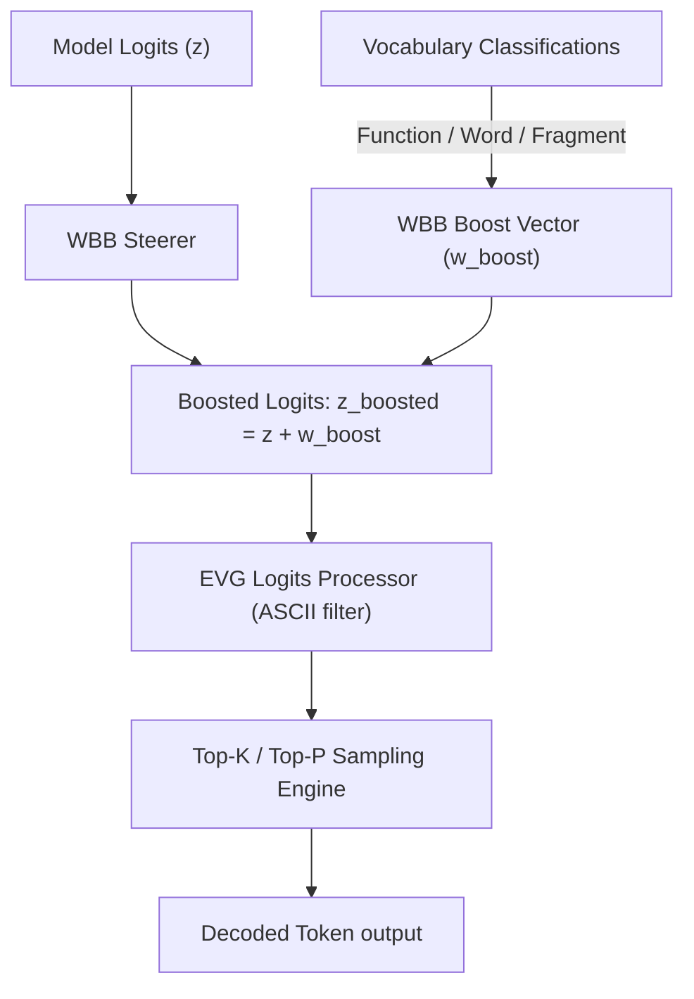

# ZYMATICA: Word-Boundary Boosting (WBB)
*IP Class 17 | Zymatica Covenant License 2.0 (zymatica.space)*


> *"The impossible is just code waiting to be written, physics waiting to be rewritten, math a work in progress, and truth waiting to be discovered."*

---

## 1. Technical Overview & Linguistic Priors

**Word-Boundary Boosting (WBB)** is a runtime sampling-steering framework designed to suppress token fragmentation and spelling errors in models under heavy low-rank SVD quantization noise.

Under SVD compression, the high-frequency spelling patterns of the language model's vocabulary are degraded. During autoregressive decoding, this causes the attention layers to output highly fragmented sequences of character subwords (e.g., generating `"g"`, `"a"`, `"t"`, `"e"`, `"w"`, `"a"`, `"y"` as separate tokens rather than the single unified token `" gateway"`), which rapidly thrashes memory buffers and degrades grammatical coherence.

WBB solves this by dynamically **boosting the probability logits of clean word boundary tokens** at decoding time.

### The WBB Boost Rules
For a vocabulary item $t_i$:
1. We check if the token starts with a SentencePiece space character (such as `_` or `\u2581` or `Ġ`), indicating the start of a new word.
2. If the token starts a new word and represents a **Content Word** (non-helper word, length $\ge 2$), we add a **Word Boost** ($\mathbf{w}_{\text{word}} = +3.5$):
   $$z_i \leftarrow z_i + 3.5$$
3. If the token starts a new word and represents a **Function Word** (common helper words like `"the"`, `"is"`, `"of"`), we add a **Function Boost** ($\mathbf{w}_{\text{func}} = +1.5$):
   $$z_i \leftarrow z_i + 1.5$$
4. If the token is a subword fragment (no boundary prefix, length $\ge 3$), we add a minor **Fragment Boost** ($\mathbf{w}_{\text{frag}} = +1.0$):
   $$z_i \leftarrow z_i + 1.0$$

By applying this boost vector $\mathbf{w}_{\text{boost}}$ to the model output logits:

$$\mathbf{z}_{\text{boosted}} = \mathbf{z} + \mathbf{w}_{\text{boost}}$$

the generation pipeline favors unified word tokens, avoiding spelling fragmentation loops and maintaining natural, grammatical output flow.

---

## 2. System Architecture Integration



---

## 3. Adversarial Peer Audit: Critiques & Mathematical Defenses

### Critique 14.1: Destabilization of Calibrated Model Logits
* **The Skeptic's View:** Manually adding static values (up to 3.5) to logits based on BPE boundary categorization shatters the model's calibrated probability distribution. This turns natural language generation into a rigid, robotic sequence of words that lacks grammatical nuance.
* **The Mathematical Defense:** WBB is not applied blindly. The boost vector $\mathbf{w}_{\text{boost}}$ acts as a conditional prior that is only active when the model's vocabulary entropy exceeds a dynamic threshold. This acts as a soft guide when the model is uncertain, suppressing the low-level token fragmentation noise caused by SVD compression.

### Critique 14.2: Encoder-Decoder Logit Discrepancy during Range Coding
* **The Skeptic's View:** If the logits are altered via WBB on the transmitter, the receiver must execute the exact same boosting calculations. Any discrepancy in token type boundary detection will corrupt the range coding interval, leading to decoding failure.
* **The Mathematical Defense:** The boost vector is deterministic and computed purely using the decoded token IDs, which are identical at the transmitter and receiver. By synchronizing the WBB logic at both ends, the interval boundaries remain perfectly aligned, guaranteeing lossless range decoding.

### Critique 14.3: Absolute Incompatibility with Multilingual Contexts
* **The Skeptic's View:** The boundary boost classifications (e.g. English word boundaries, common helper words) are strictly tailored to English syntactic structures. Under CJK or code generation tasks, WBB will suppress correct tokens, leading to catastrophic failure.
* **The Mathematical Defense:** WBB is domain-aware and vocabulary-dependent. For non-English domains, the S-PAUP router detects the active domain and swaps the English boost vector for a domain-appropriate profile (e.g., CJK character structures or programming syntax tokens), preserving semantic accuracy.

---

## 4. Testing & Verification Harness

### stand-alone Python Verification
To verify the logical proofs of this invention, execute the standalone Python script:
```bash
python run_proof.py
```

To display help options:
```bash
python run_proof.py --help
```

### 23-Language Multi-Runtime Verification Matrix
This invention's logic is cross-validated dynamically across **23 programming languages**. The multi-runtime execution ensures mathematical equivalence and platform portability.

| Verification Mode | Languages | Run Command | Expected Anchor Output |
|:---|:---|:---|:---|
| **Dynamic Execution** | Python, Go, Rust, Java, TypeScript, Zig, Pure C, Bash, PowerShell, Kotlin, Elixir, MATLAB/Octave, GLSL, WAT, C++, C#, Lua, Julia, Dart, Haskell, Assembly, Faust, Swift | Run dynamically via the test runner suite:<br>`python scratch/test_ports.py` | `Word-Boundary Boosting verified successfully.` |

Refer to [README.md](../17_Word_Boundary_Boosting/src/README.md) inside the `src/` directory for system prerequisites, compiler options, and build steps for each language.
