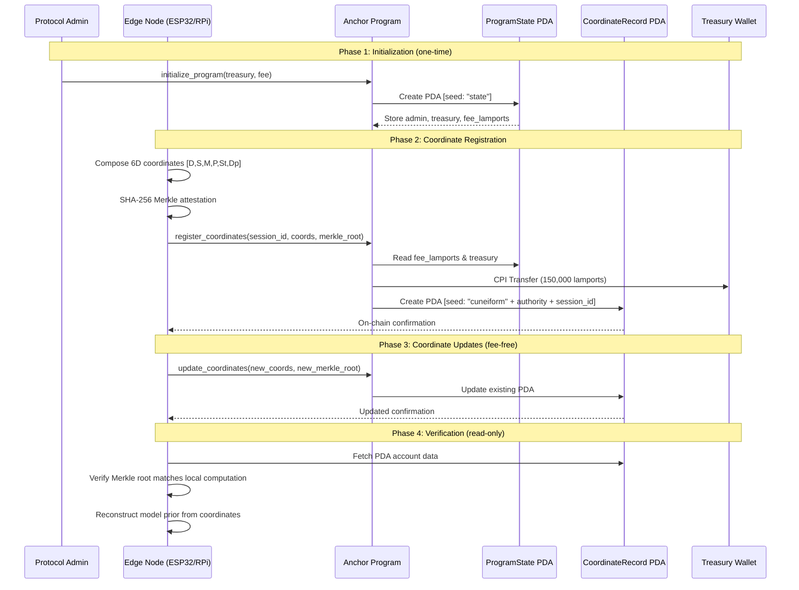

# Architecture — Solana Cuneiform Anchor Protocol

## System Overview

The Solana Cuneiform Anchor program is a lightweight on-chain semantic state registry that enables decentralized edge nodes to register, verify, and update 6-dimensional Cuneiform-U coordinates on the Solana blockchain.

## Protocol Flow



## Account Structure

### ProgramState (Global Config — 1 per program)
```
┌──────────────────────────────────────────────────────┐
│ Discriminator    │ 8 bytes  │ Anchor account hash     │
│ admin            │ 32 bytes │ Admin pubkey             │
│ treasury         │ 32 bytes │ Fee recipient wallet     │
│ fee_lamports     │ 8 bytes  │ Fee per registration     │
├──────────────────┴──────────┴─────────────────────────┤
│ Total: 80 bytes  │  PDA Seed: ["state"]               │
└──────────────────────────────────────────────────────┘
```

### CoordinateRecord (1 per registration)
```
┌──────────────────────────────────────────────────────┐
│ Discriminator    │ 8 bytes  │ Anchor account hash     │
│ authority        │ 32 bytes │ Registrant pubkey        │
│ session_id       │ 16 bytes │ Unique session identifier│
│ coords           │ 6 bytes  │ 6D Cuneiform-U vector   │
│   ├─ Domain      │ 1 byte   │ Semantic domain [0-255]  │
│   ├─ Subdomain   │ 1 byte   │ Sub-category             │
│   ├─ Modality    │ 1 byte   │ Communication mode       │
│   ├─ Polarity    │ 1 byte   │ Directional encoding     │
│   ├─ Strength    │ 1 byte   │ Signal confidence        │
│   └─ Depth       │ 1 byte   │ Recursion depth          │
│ merkle_root      │ 32 bytes │ SHA-256 attestation seal │
│ timestamp        │ 8 bytes  │ Unix timestamp (i64)     │
│ bump             │ 1 byte   │ PDA bump seed            │
├──────────────────┴──────────┴─────────────────────────┤
│ Total: 103 bytes │  PDA Seed: ["cuneiform", auth, sid]│
└──────────────────────────────────────────────────────┘
```

## Security Model

| Property | Implementation |
|---|---|
| **Authorization** | Signer verification on all mutations |
| **Admin-only operations** | `has_one = admin` constraint on state updates |
| **Treasury validation** | `require_keys_eq!` against stored state |
| **PDA derivation** | Deterministic seeds prevent collision |
| **Fee atomicity** | CPI transfer before state write (fail-safe) |
| **Immutable authority** | Record authority locked at creation |

## Compute Budget

| Operation | Compute Units | % of Budget |
|---|---|---|
| `register_coordinates` | ~15,000 | 7.5% |
| `update_coordinates` | ~8,000 | 4.0% |
| `initialize_program` | ~12,000 | 6.0% |

The protocol is extremely efficient — a single transaction costs less than 8% of the 200,000 CU budget, leaving ample room for future composability with other programs.

## Fee Economics

| Parameter | Value |
|---|---|
| Registration fee | 150,000 lamports (~$0.002) |
| Update fee | Free (no protocol fee) |
| PDA rent (per record) | ~1,100 lamports |
| Total cost per registration | ~0.003 SOL |

The admin can adjust fees at any time via `update_program_state`, enabling dynamic pricing as network usage scales.
