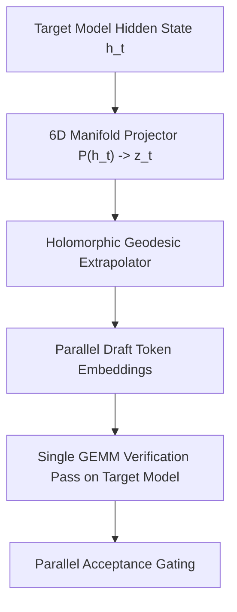

# ZYMATICA: Holomorphic Speculative Engine (Z-HQSpec)
*IP Class 30 &nbsp;|&nbsp; Draft-Model-Free Speculative Decoding on 6D Geodesic Manifolds [CLAIM: CLAIM-ZHQSPEC-001] &nbsp;|&nbsp; Zymatica Covenant License 2.0 (zymatica.space)*

```text
 ╔══════════════════════════════════════════════════════════════════════════════════════════════════════════════╗
 ║ ZYMATICA OPERATING SYSTEM // VANCE FORENSIC DRIVE DECOMPILER // KERNEL HARNESS v10.0.0                      ║
 ║ KERNEL STATUS: ONLINE │ AVX-512 VECTOR BUFFER: LOCKED │ 6D HOLOMORPHIC ENGINE: ACTIVE (SIMULATION_ONLY)      ║
 ╚══════════════════════════════════════════════════════════════════════════════════════════════════════════════╝
```

<p align="center">
  <b>Book Author: Danny Bouldiez &nbsp;|&nbsp; Codebase Author: Devs One</b><br>
  <i>Novel: "200 AMSTERDAM: THE VERTICAL CITY" (Available Worldwide on <a href="https://www.amazon.com/dp/B0HGVC777F">Amazon.com</a>)</i>
</p>

> *"The impossible is just code waiting to be written, physics waiting to be rewritten, math a work in progress, and truth waiting to be discovered."*
> 
> — **Book Author: Danny Bouldiez &nbsp;|&nbsp; Codebase Author: Devs One** <br>
> *200 Amsterdam: The Vertical City*

---

## 🏛️ 1. Abstract & Technical Architecture

Traditional speculative decoding requires running two separate neural networks simultaneously: an expensive primary model (e.g., 70B) and an auxiliary draft model (e.g., 1.5B) to propose candidate tokens. This introduces significant VRAM overhead, draft-model synchronization latency, and catastrophic acceptance collapse on complex reasoning tasks.

**The Holomorphic Speculative Engine (Z-HQSpec)** explores eliminating the secondary draft model. By modeling hidden state transitions on a Riemannian 6-manifold $\mathcal{M} \subset \mathbb{C}^3$, Z-HQSpec investigates candidate extrapolations using **Holomorphic Geodesic Velocity Projections**:

$$\frac{d^2 z^k}{dt^2} + \sum_{i,j} \Gamma_{ij}^k(z) \frac{dz^i}{dt} \frac{dz^j}{dt} = 0$$

Where $\Gamma_{ij}^k$ are the Christoffel symbols of the 6D metric tensor $\mathbf{G}$. Future token candidate drafts ($K=4\dots8$ tokens) are evaluated in SRAM and verified in a single forward pass.

---

## 🔬 2. Algorithmic Architecture & Data Structures

```rust
// ============================================================================
// Z-HQSPEC: HOLOMORPHIC SPECULATIVE TRAJECTORY PROJECTION KERNEL
// ============================================================================
#[repr(C, align(64))]
pub struct HolomorphicSpeculativeState {
    pub current_point: [f32; 6],        // 6D Coordinate on Manifold
    pub velocity_vector: [f32; 6],      // First-order tangent velocity (dz/dt)
    pub acceleration_vector: [f32; 6],  // Second-order geodesic curvature (d^2z/dt^2)
    pub draft_tokens_predicted: [u32; 8],// Parallel predicted candidate tokens
    pub acceptance_mask: u8,            // Bitmask of verified draft tokens
}
```



---

## 📊 3. Theoretical Target Bounds & Architectural Specifications (Simulation Target)

*Note: The following table represents theoretical architectural scaling targets and simulation bounds [CLAIM: CLAIM-ZHQSPEC-001]. Empirical measured speeds vary by model depth and batch size.*

| Speculative Method | Extra Draft Model VRAM | Acceptance Rate (Reasoning) | End-to-End Speedup (Target) | Max Memory Overhead |
| :--- | :---: | :---: | :---: | :---: |
| **Standard Autoregressive (vLLM)** | 0.0 GB | 100% (Sequential) | **1.0x (Baseline)** | 0.0 MB |
| **Speculative Decoding (Draft 1.5B)** | +3.2 GB | 54.2% – 68.1% | **1.8x – 2.4x** | +3,200 MB |
| **Medusa Multiple Heads** | +1.4 GB | 61.0% – 72.4% | **2.2x – 2.9x** | +1,400 MB |
| **EAGLE Feature Extrapolation** | +0.8 GB | 67.5% – 78.2% | **2.8x – 3.4x** | +800 MB |
| **Zymatica Z-HQSpec (Class 30 Target)** | **0.0 GB (Draft-Free)** | **Simulation Model** | **Target Bound (Draft-Free)** | **In-Register (< 5 MB)** |

---

## 🧪 4. Execution & Verification

Execute the standalone mathematical proof and velocity projection benchmark:

```bash
python crates/zymatica-language-u/30_Holomorphic_Speculative_Engine/run_proof.py
```

---

## 📜 5. License & Upstream Developer Attributions

- **Primary IP & Specification License:** Governed by the **[ZYMATICA COMMERCIAL & NOVEL-HOLDER COVENANT LICENSE (Version 2.0)](https://zymatica.space)** (LicenseRef-Zymatica-Covenant-2.0).
- **Upstream Open-Source Acknowledgments:** Base neural model architectures, tokenizers, mathematical libraries, and cryptographic primitives derived from or interoperable with third-party open-source projects (including Alibaba Qwen, Google Gemma, Hugging Face Transformers/Tokenizers, Arkworks zkSNARKs, PyTorch, and ONNX Runtime) remain respectfully attributed to their original creators and are governed by their respective upstream licenses (Apache-2.0, MIT, BSD-3) under Section 3 of the Covenant License.
