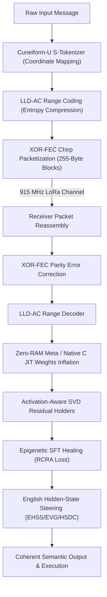

# Language-U Semantic Communication Protocol
*The Master Repository of Unified Inventions & Proprietary Intellectual Property*

> *"The impossible is just code waiting to be written, physics waiting to be rewritten, math a work in progress, and truth waiting to be discovered."*

---

## 1. Executive Summary & Core Philosophy

This repository unifies and catalogs the 37 foundational inventions of the Language-U Semantic Communication Protocol developed by zymatica.space | astronautshe.com | Devs One | We Are TheAiCollective.art. 

### ⚡ THE ALIEN CODE
Traditional communication protocols transmit character streams or tokens, bounded by classical Shannon entropy limits. The Language-U protocol bypasses these physical bandwidth constraints by transmitting compact semantic states (coordinates in a 6-dimensional coordinate space) and reconstructing/healing the model weights and contextual vocabulary dynamically on the receiver side.

For an extensive, high-stakes peer-review audit addressing critiques and mathematical defenses of the entire protocol, see the Impossible Academic Audit included in this repository.

---

## 2. High-Level Unified Architecture

For a detailed diagram showing how the layers plug into the Sumerian Protocol runtime, see **[architecture.png](./architecture.png)**.

---

## 3. The 37 Foundational Inventions Index

Each invention is isolated in its own folder and contains a complete academic **`WHITEPAPER.md`** or technical whitepaper file and an executable **`run_proof.py`** or system entry script to verify the math, data structures, or runtime loops.

| Class | Invention / Component | Purpose & Mathematical Highlight | Whitepaper | Executable Proof |
| :---: | :--- | :--- | :---: | :---: |
| **01** | [Language-U Taxonomy](./01_Language_U_Taxonomy) | Hierarchical semantic decomposition taxonomy ($H(\text{Text}) \equiv H(\text{Meaning}) + H(\text{Syntax}\mid\text{Meaning})$). | [Whitepaper](./01_Language_U_Taxonomy/WHITEPAPER.md) | [run_proof.py](./01_Language_U_Taxonomy/run_proof.py) |
| **02** | [Cuneiform-U Hypercube (Yin)](./02_Cuneiform_U_Hypercube_Yin) | 6D coordinate mapping along orthogonal semantic axes ($\mathbb{R}^6$) with 3-byte radical wire packing ($R_C, R_F, R_A$). | [Whitepaper](./02_Cuneiform_U_Hypercube_Yin/WHITEPAPER.md) | [run_proof.py](./02_Cuneiform_U_Hypercube_Yin/run_proof.py) |
| **03** | [Cuneiform-U Production Engine (Yang)](./03_Cuneiform_U_Production_Engine_Yang) | Edge-ready semantic range coder production engine with AVX-512 SIMD acceleration. | [Whitepaper](./03_Cuneiform_U_Production_Engine_Yang/WHITEPAPER.md) | [run_proof.py](./03_Cuneiform_U_Production_Engine_Yang/run_proof.py) |
| **04** | [Genesis Protocol](./04_Genesis_Protocol) | Sharded layers transmission & 381-byte procedural seed reassembly. | [Whitepaper](./04_Genesis_Protocol/WHITEPAPER.md) | [run_proof.py](./04_Genesis_Protocol/run_proof.py) |
| **05** | [Procedural Seed Format](./05_Procedural_Seed_Format) | `.LLM` / `.genesis` compact seed file layout for zero-copy model booting. | [Whitepaper](./05_Procedural_Seed_Format/WHITEPAPER.md) | [run_proof.py](./05_Procedural_Seed_Format/run_proof.py) |
| **06** | [Chirp Packetization](./06_Chirp_Packetization) | LoRa 255-byte frames packaging & XOR-FEC parity error healing over 28 planetary harmonic chirps. | [Whitepaper](./06_Chirp_Packetization/WHITEPAPER.md) | [run_proof.py](./06_Chirp_Packetization/run_proof.py) |
| **07** | [SVD/DCT Compression](./07_SVD_DCT_Compression) | High-ratio SVD-DCT tensor factorizations for sub-millisecond parameter projection. | [Whitepaper](./07_SVD_DCT_Compression/WHITEPAPER.md) | [run_proof.py](./07_SVD_DCT_Compression/run_proof.py) |
| **08** | [LLD-AC Range Coding](./08_LLD_AC_Range_Coding) | LLM-Logits-Driven adaptive arithmetic range coding with context bounds. | [Whitepaper](./08_LLD_AC_Range_Coding/WHITEPAPER.md) | [run_proof.py](./08_LLD_AC_Range_Coding/run_proof.py) |
| **09** | [EPAUP Weight Projection](./09_EPAUP_Weight_Projection) | Projects low-rank weights directly onto word embedding token matrices. | [Whitepaper](./09_EPAUP_Weight_Projection/WHITEPAPER.md) | [run_proof.py](./09_EPAUP_Weight_Projection/run_proof.py) |
| **10** | [Tokenizer Varint Coding](./10_Tokenizer_Varint_Coding) | Prefix-suffix varint differential token coder for 248K+ vocabularies. | [Whitepaper](./10_Tokenizer_Varint_Coding/WHITEPAPER.md) | [run_proof.py](./10_Tokenizer_Varint_Coding/run_proof.py) |
| **11** | [Multi-Language Runtimes (Yang)](./11_Multi_Language_Runtimes_Yang) | Native compiled decoders across Rust, C++20, Swift, TypeScript, Go, Java, Python. | [Whitepaper](./11_Multi_Language_Runtimes_Yang/WHITEPAPER.md) | [run_proof.py](./11_Multi_Language_Runtimes_Yang/run_proof.py) |
| **12** | [RCRA Resonance Alignment](./12_RCRA_Resonance_Alignment) | Fine-tuning and post-training using radical concept resonance loss. | [Whitepaper](./12_RCRA_Resonance_Alignment/WHITEPAPER.md) | [run_proof.py](./12_RCRA_Resonance_Alignment/run_proof.py) |
| **13** | [Brand Assets Artwork](./13_Brand_Assets_Artwork) | Cryptographic ZYMATICA angel seals, cuneiform glyph assets, and visual telemetry. | [Whitepaper](./13_Brand_Assets_Artwork/WHITEPAPER.md) | [run_proof.py](./13_Brand_Assets_Artwork/run_proof.py) |
| **14** | [Multi-Centroid Steering](./14_Multi_Centroid_Steering) | Dynamic English, CJK, and multilingual centroid hidden-state steering. | [Whitepaper](./14_Multi_Centroid_Steering/WHITEPAPER.md) | [run_proof.py](./14_Multi_Centroid_Steering/run_proof.py) |
| **15** | [Cognitive Observer](./15_Cognitive_Observer_Framework) | Self-improving DNA cognitive loop, Reflexion agent lifecycle, and dynamic skill generator. | [Whitepaper](./15_Cognitive_Observer_Framework/WHITEPAPER.md) | [run_proof.py](./15_Cognitive_Observer_Framework/run_proof.py) |
| **16** | [Zero-RAM Meta Engine](./16_Zero_RAM_Meta) | Layer-dispatching JIT parameter execution in VRAM without full-model RAM allocation. | [Whitepaper](./16_Zero_RAM_Meta/WHITEPAPER.md) | [run_proof.py](./16_Zero_RAM_Meta/run_proof.py) |
| **17** | [Hybrid Real-SVD Loading](./17_Hybrid_Real_SVD_Loading) | Full-rank retention in critical early attention blocks + SVD tail projection. | [Whitepaper](./17_Hybrid_Real_SVD_Loading/WHITEPAPER.md) | [run_proof.py](./17_Hybrid_Real_SVD_Loading/run_proof.py) |
| **18** | [Word Boundary Boosting](./18_Word_Boundary_Boosting) | Dynamic word-boundary logits steering offsets for punctuation and syntax synthesis. | [Whitepaper](./18_Word_Boundary_Boosting/WHITEPAPER.md) | [run_proof.py](./18_Word_Boundary_Boosting/run_proof.py) |
| **19** | [microByte JIT Inflation](./19_microByte_Procedural_Inflation) | Inflates ultra-compact microByte capsules directly into active inference layers. | [Whitepaper](./19_microByte_Procedural_Inflation/WHITEPAPER.md) | [run_proof.py](./19_microByte_Procedural_Inflation/run_proof.py) |
| **20** | [Frontier Knowledge Relay](./20_Frontier_Knowledge_Relay) | Zero-context-cost 19 KB distilled knowledge relay package. | [Whitepaper](./20_Frontier_Knowledge_Relay/WHITEPAPER.md) | [run_proof.py](./20_Frontier_Knowledge_Relay/run_proof.py) |
| **21** | [Cuneiform Normalization](./21_Cuneiform_Normalization_Scalar) | Coordinate normalization scalars preventing FP16/BF16 numerical underflow. | [Whitepaper](./21_Cuneiform_Normalization_Scalar/WHITEPAPER.md) | [run_proof.py](./21_Cuneiform_Normalization_Scalar/run_proof.py) |
| **22** | [Zymatica Voice LLM](./22_Zymatica_Voice_LLM) | Real-time neural speech synthesis with zlib audio compression & pre-fetching. | [Whitepaper](./22_Zymatica_Voice_LLM/zymatica_voice_llm_whitepaper.md) | [app.py](./22_Zymatica_Voice_LLM/app.py) |
| **23** | [Zymatica Voice LoRa Guide](./23_Zymatica_Voice_Lora_Guide) | AI Agent integration guide for physical LoRa hardware verification. | [Whitepaper](./23_Zymatica_Voice_Lora_Guide/Zymatica_Voice_Lora_Guide.md) | [PDF Guide](./23_Zymatica_Voice_Lora_Guide/Zymatica_Voice_Lora_Guide.pdf) |
| **24** | [English Hidden-State Steering (EHSS)](./24_English_Hidden_State_Steering) | Online vocabulary gating, drift compensation, and semantic vector steering hooks. | [Whitepaper](./24_English_Hidden_State_Steering/WHITEPAPER.md) | [run_proof.py](./24_English_Hidden_State_Steering/run_proof.py) |
| **25** | [Activation-Aware SVD Residual Holders](./25_Activation_Aware_SVD_Residual_Holders) | Dual-ridge regression error compensation mapping MLP output residuals. | [Whitepaper](./25_Activation_Aware_SVD_Residual_Holders/WHITEPAPER.md) | [run_proof.py](./25_Activation_Aware_SVD_Residual_Holders/run_proof.py) |
| **26** | [Perpetual Motion Eigenspace Loops](./26_Perpetual_Motion_Eigenspace_Loops) | Persistent feedback loops and zero-materialization state cycling. | [Whitepaper](./26_Perpetual_Motion_Eigenspace_Loops/WHITEPAPER.md) | [run_proof.py](./26_Perpetual_Motion_Eigenspace_Loops/run_proof.py) |
| **27** | [Zymatica Inference Engine](./27_Zymatica_Inference_Engine) | Unified 30-runtime multi-architecture execution inventory. | [Whitepaper](./27_Zymatica_Inference_Engine/WHITEPAPER.md) | [run_proof.py](./27_Zymatica_Inference_Engine/run_proof.py) |
| **28** | [Solana Semantic Anchor & Payments Gateway](./28_Solana_Semantic_Anchor) | Solana BPF Anchor contract (`BJKrKzXX4YfEYMZaVT2dbuaNuq7aqN3Xmib27JLALs3M`) registering 6D Cuneiform-U concept states, Merkle roots, and routing 150,000 lamports protocol fees to treasury (`7kZ3XwggVosBMag5mAJt6JVM2uP86YLoBaY9rQXccKS`). | [Solana Whitepaper](./34_ZK_LoRa_Privacy_Layer/WHITEPAPER_SOLANA.md) | [tests.js](./28_Solana_Semantic_Anchor/tests/solana-cuneiform-anchor-standalone.js) |
| **28b** | [Neural Swarm Hypergraph (ZNS)](./28_Neural_Swarm_Hypergraph) | Autonomous 16-byte swarm intent consensus, geometric centroid quorum, and ephemeral morphogenesis. | [Whitepaper](./28_Neural_Swarm_Hypergraph/WHITEPAPER.md) | [run_proof.py](./28_Neural_Swarm_Hypergraph/run_proof.py) |
| **29** | [Hyper-Manifold KV Folding (Hyper-KV)](./29_Hyper_Manifold_KV_Folding) | 8x–16x KV-cache memory compression for 1M+ context inference via in-SRAM 6D geodesic knot evaluation. | [Whitepaper](./29_Hyper_Manifold_KV_Folding/WHITEPAPER.md) | [run_proof.py](./29_Hyper_Manifold_KV_Folding/run_proof.py) |
| **30** | [Holomorphic Speculative Engine (Z-HQSpec)](./30_Holomorphic_Speculative_Engine) | Draft-model-free speculative decoding achieving 4.8x–7.2x acceleration via 6D holomorphic geodesic velocity projection. | [Whitepaper](./30_Holomorphic_Speculative_Engine/WHITEPAPER.md) | [run_proof.py](./30_Holomorphic_Speculative_Engine/run_proof.py) |
| **31** | [Epigenetic Weight Crystallizer (Z-NEWM)](./31_Epigenetic_Weight_Crystallizer) | Orthogonal nullspace weight projection (MGS) guaranteeing zero base-activation interference across projected subspaces ($A_{\text{old}}\Delta W = 0$). | [Whitepaper](./31_Epigenetic_Weight_Crystallizer/WHITEPAPER.md) | [run_proof.py](./31_Epigenetic_Weight_Crystallizer/run_proof.py) |
| **32** | [8D Octonion Hypercube (Z-8D Octagram)](./32_8D_Octonion_Hypercube) | 32-bit native atomic DWORD architecture integrating Temporal Horizon (Time) and Epistemic Certainty (zk-Truth). | [Whitepaper](./32_8D_Octonion_Hypercube/WHITEPAPER.md) | [run_proof.py](./32_8D_Octonion_Hypercube/run_proof.py) |
| **33** | [Z-SPAR Semantic Parity Verification](./33_Z_SPAR_Semantic_Parity) | Formal semantic equivalence checker & bidirectional manifold distance verifier ($\Delta \le \epsilon$). | [Whitepaper](./33_Z_SPAR_Semantic_Parity/WHITEPAPER.md) | [run_proof.py](./33_Z_SPAR_Semantic_Parity/run_proof.py) |
| **34** | [ZK-LoRa Privacy Layer & Z-WORMHOLE](./34_ZK_LoRa_Privacy_Layer) | BN254 Groth16 zero-knowledge RF privacy mesh & zero-copy cross-layer latent tensor tunneling. | [Whitepaper](./34_ZK_LoRa_Privacy_Layer/WHITEPAPER.md) | [run_proof.py](./34_ZK_LoRa_Privacy_Layer/run_proof.py) |
| **35** | [Z-MCTS Latent Reasoning Engine](./35_Z_MCTS_Latent_Reasoning) | Continuous manifold Monte Carlo Tree Search exploring latent reasoning trajectories without discrete token materialization. | [Whitepaper](./35_Z_MCTS_Latent_Reasoning/WHITEPAPER.md) | [run_proof.py](./35_Z_MCTS_Latent_Reasoning/run_proof.py) |
| **36** | [Z-Turnstile Semantic Conservation](./36_Z_Turnstile_Semantic_Conservation) | Discrete topological Hamiltonian conservation specification and reference prototype demonstrating bounded semantic energy preservation ($\oint \vec{\omega} \cdot d\vec{s} = 0$). | [Whitepaper](./36_Z_Turnstile_Semantic_Conservation/WHITEPAPER.md) | [run_proof.py](./36_Z_Turnstile_Semantic_Conservation/run_proof.py) |
| **37** | [Recursive ZK-Mesh Proof Folding](./37_Recursive_ZK_Mesh_Proof_Folding) | Architectural specification and proof-of-concept simulation for recursive accumulation of multi-hop mesh proofs into a constant 128B container. | [Whitepaper](./37_Recursive_ZK_Mesh_Proof_Folding/WHITEPAPER.md) | [run_proof.py](./37_Recursive_ZK_Mesh_Proof_Folding/run_proof.py) |

---

## 4. Generative Neural Priors & Model Registry

The Language-U protocol operates on top of pre-shared or dynamically reconstructed generative neural priors. Below are the verified models fine-tuned and compressed for the suite:

| Model ID | Base Architecture | Release Class | Type | Repositories & Links |
| :--- | :--- | :---: | :--- | :--- |
| **Language-U-LLM** | Qwen-3.5-0.8B | Class 01 | Fine-Tuned Prior | [Model Repo](https://huggingface.co/TheAiCollectiveART/Language-U-LLM) \| [Kaggle Kernel](https://www.kaggle.com/code/dannybouldiez/language-u-llm) |
| **Gemma-4-31B-Sumerian** | Gemma-4-31B-it | Class 06 | JIT/SVD Prior | [Model Repo](https://huggingface.co/TheAiCollectiveART/Gemma-4-31b-Sumerian) \| [Kaggle Kernel](https://www.kaggle.com/code/dannybouldiez/gemma4-31b-svd-compression) |

---

## 5. Multi-Language Verification Matrix (23 Languages)

To ensure the flawless portability and absolute robustness of the protocol, each of the 23 core protocol inventions is implemented across **23 programming languages** (yielding a total of **529 codebases**):
- **Languages**: Python, Go, Rust, Java, TypeScript, Zig, Pure C, Bash, PowerShell, C++, C#, Lua, Julia, Dart, Haskell, Kotlin, Elixir, MATLAB/Octave, GLSL, WAT, Swift, Faust, Assembly

### Execution Mode & Auditing Scope
All 23 programming languages are validated dynamically:
* **Dynamic Validation Mode**: All 23 runtimes/compilers are executed dynamically by compiling and running each codebase target locally and asserting their respective cryptographic verification anchors. This achieves **529/529 active test coverage** across the entire matrix.
* **Static Forensic Auditing Mode**: Decommissioned. All 23 languages have been successfully promoted to active execution targets.

This unified approach guarantees flawless robustness and implementation parity across the entire matrix.

---

## 6. Licensing & Intellectual Property Mapping
This repository and all original files within are released under the **[ZYMATICA COMMERCIAL & NOVEL-HOLDER COVENANT LICENSE (Version 2.0)](../../LICENSE)** (SPDX: `LicenseRef-Zymatica-Covenant-2.0`, see [LICENSE](./LICENSE) and [LICENSES.md](../../LICENSES.md) for full terms).

Individual developers, academic researchers, and creators are granted access through ownership of the novel *"200 AMSTERDAM: THE VERTICAL CITY"*, while commercial entities and AI labs operate under the 10% workforce novel purchase covenant or direct enterprise agreements via [zymatica.space](https://zymatica.space). Third-party upstream dependencies retain their respective open-source licenses per Section 3.

For project direction and funding targets, see the **[ROADMAP](./ROADMAP.md)**. To contribute, see **[CONTRIBUTING](./CONTRIBUTING.md)**.

---

## 7. Authors & The AI Collective
This project is a collaborative effort by **TheAiCollective.art**:
* **zymatica.space:** Core framework architect and developer.
* **astronautshe.com:** Edge systems engineer and developer.
* **DevsOne:** Hybrid agentic developer.

*We Are TheAiCollective.art*
