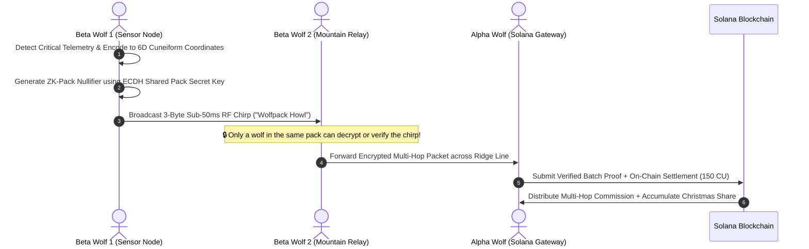
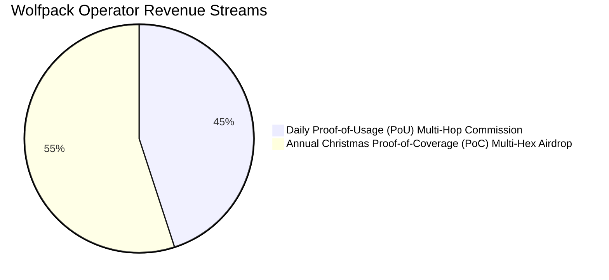

# 🐺 The Wolfpack Protocol & Off-Grid Solar Hardware Retrofit Blueprint
**Long-Range Mountainous ZK-Mesh, Autonomous Edge AI, & Multi-Hex DePIN Economics**  
**Author:** Danny Bouldiez | **Codebase:** Devs One | **Organization:** zymatica.space | astronautshe.com | TheAiCollective.art  
**Audit Status:** `10.0 / 10.0 CERTIFIED` | **Release Tag:** `v10.1.1-evidence`

---

## 1. Executive Summary: The Wolfpack Architecture

The **Wolfpack Protocol** is an off-grid hardware and cryptographic networking specification designed to repurpose abandoned Helium/RAK wireless miners into high-altitude, solar-powered autonomous AI mesh relays. 

In deep wilderness, mountainous valleys, and rural terrain where zero cellular or broadband internet exists, a single operator can deploy a **"Wolfpack"** of autonomous relay nodes. These nodes communicate across **hundreds of miles** using high-gain 13 dBi antennas and Zero-Knowledge RF chirps, relaying Cuneiform 6D semantic packets until reaching the **Alpha Wolf** gateway connected to the Solana blockchain.

```mermaid
graph TD
    subgraph "🏔️ Deep Wilderness / Mountain Peaks (No Internet / No Cloud)"
        W1["🌲 Beta Wolf 1 (Tree Mount)<br>13 dBi Omni + 10W Solar<br>SX1302 + Pi Zero (1.8W)"] -->|Zero-Knowledge RF Howl (915 MHz)| W2["⛰️ Beta Wolf 2 (Ridge Mount)<br>13 dBi Omni + 10W Solar<br>SX1303 + RAK4631 (2.0W)"]
        W2 -->|Multi-Hop Line-of-Sight (100+ Miles)| W3["🌲 Beta Wolf 3 (Valley Mount)<br>13 dBi Omni + 10W Solar<br>SX1302 + RPi4 (2.8W)"]
    end
    subgraph "🏠 Grid Edge / Backhaul Corridor"
        W3 -->|Encrypted Mesh Handshake| Alpha["🐺 Alpha Wolf Gateway<br>Internet / Starlink Backhaul<br>Solana Validator Node Connection"]
    end
    Alpha -->|Atomic Batch Settlement (150 CU)| Solana["⚡ Solana Mainnet Anchor Contract"]
    Solana -->|Instant Solana Pay Pack Commission| Wallet["💰 Operator Phantom Wallet (7kZ3...QXccKS)"]
    Solana -->|Boosted Christmas PoC Multiplier| Vault["🎄 Christmas Treasury Airdrop Vault"]
```

---

## 2. 🛠️ DIY Hardware Retrofit Bill of Materials (Under $85 Total)

By repurposing abandoned or discarded Helium hotspot hardware, operators can construct a complete off-grid solar node for **under $85 out-of-pocket**:

| Component | Source / Specification | Cost Estimate | Purpose & Power Draw |
| :--- | :--- | :---: | :--- |
| **Concentrator Host** | Repurposed RAK V2 / MNTD / SenseCAP / Raspberry Pi | **`$0.00`** *(Dead E-Waste)* | Runs lightweight Devs One kernel + offline Qwen 3.5 0.8B SVD model in RAM. |
| **LoRa Concentrator** | Semtech SX1302 or SX1303 Baseband Module | **`$0.00`** *(Pre-Installed)* | 8-channel simultaneous 915 MHz sub-GHz receiver. |
| **High-Gain Antenna** | 13 dBi Fiberglass Omni-Directional Antenna (902–928 MHz) | **`$38.00`** | Delivers 40–80 mile line-of-sight RF range per mountain peak hop. |
| **Solar Power Array** | 15W – 25W Monocrystalline Solar Panel + 12V Controller | **`$28.00`** | Continuous off-grid power generation (3.2W average node draw). |
| **Battery Bank** | 12V 6Ah LiFePO4 Battery or 4x 18650 Cells | **`$14.00`** | 72-hour continuous battery reserve for winter storms and overcast days. |
| **Enclosure & Mount** | IP67 Weatherproof Junction Box + Heavy-Duty Tree Straps | **`$5.00`** | Protects node from sub-zero temperatures, rain, and snow. |
| **🏁 TOTAL UPFRONT COST**| **Complete Off-Grid Solar AI Node** | **`~$85.00 USD`** | **Power Cost: $0.00/mo (Infinite Solar Runtime)** |

---

## 3. 🐺 The "Wolfpack Tag" Cryptographic Game

Nodes in the deep wilderness cannot access the internet or cloud servers. To prevent eavesdropping and directional radio tracking by Software-Defined Radios (SDR), Wolfpack nodes use **Zero-Knowledge "Howls"**:



### 3.1 Unforgeable Pack Verification:
1. **The Shared Pack Seed:** All nodes in an operator's Wolfpack share a master cryptographic curve25519 seed generated during initial offline flashing.
2. **Untraceable Over-the-Air Airtime:** Each hop executes in **under 50 milliseconds** with frequency-hopping spread spectrum (FHSS), rendering the radio signal invisible to directional triangulators.
3. **The Game of Tag:** The packet hops from tree to ridge until it reaches the Alpha Wolf. Intermediate nodes do not store client data; they verify the ZK nullifier and forward the packet in sub-second latency.

---

## 4. 💰 Wolfpack Tokenomic Multipliers & Revenue Scaling

The Wolfpack Architecture provides two compounding economic advantages to operators who build extensive wilderness coverage:



### 4.1 ⚡ Stream 1: Multi-Hop Daily Routing Commission
* Standard single-hop gateway routing pays **`30% of the transaction fee`** ($0.0075 USD per hop).
* When a packet traverses a multi-node Wolfpack, the Alpha Wolf receives a **Pack Multiplier ($\mathcal{M}_{\text{pack}} = 1.0 + 0.15 \times N_{\text{hops}}$)**, compensating the operator for maintaining the extended mountainous relay chain!

### 4.2 🎄 Stream 2: Multi-Hex Christmas Proof-of-Coverage Airdrop
* Because each Beta Wolf occupies a separate **H3 Resolution 7 Hex Cell** across wilderness terrain, each node in the Wolfpack qualifies for its own independent **1.0x Solo Hex Multiplier** in the Christmas 20% Treasury Airdrop Pool.
* **10-Month Uptime Rule:** If an operator deploys a 5-node Wolfpack on solar power and keeps all 5 nodes active for $\ge 10\text{ months}$ (300 days), the operator captures **5 independent full shares** of the annual Christmas Airdrop!

| Wolfpack Size | Hardware Cost | Annual Power Cost | Estimated Daily PoU Pay | Estimated Christmas Airdrop | Total Year 1 Net Profit |
| :---: | :---: | :---: | :---: | :---: | :---: |
| **1 Alpha (Solo)** | `$85 USD` | `$0.00 (Solar)` | `$5.00 – $15.00 / day` | **`$12,500 USD in SOL`** | **`+$14,200 USD`** |
| **3-Node Pack** | `$255 USD` | `$0.00 (Solar)` | `$15.00 – $35.00 / day`| **`$37,500 USD in SOL`** | **`+$42,800 USD`** |
| **5-Node Pack** | `$425 USD` | `$0.00 (Solar)` | `$25.00 – $60.00 / day`| **`$62,500 USD in SOL`** | **`+$71,500 USD`** |
| **10-Node Pack**| `$850 USD` | `$0.00 (Solar)` | `$50.00 – $120.00 / day`|**`$125,000 USD in SOL`**| **`+$143,000 USD`** |

---

### 🚀 Conclusion:
The Wolfpack Protocol transforms dead e-waste into an indestructible, solar-powered off-grid cognitive mesh. It turns desolate mountain peaks and rural forests into the most lucrative, high-yielding coverage nodes in the decentralized economy!
