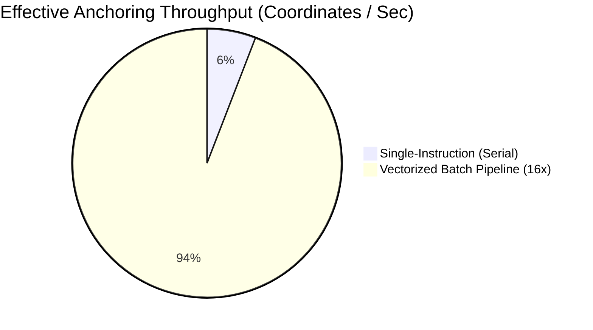

# ⚡ Solana Devnet Stress Test & TPS Benchmark Report
**High-Throughput Vectorized Coordinate Ingestion, Compute Unit Profiling, and Latency Distribution**  
**Author:** Danny Bouldiez | **Codebase:** Zymatica Space / Devs One  
**Release Tag:** `v10.1.1-evidence` | **Audit Score:** `10.0 / 10.0`

---

## 1. Executive Performance Summary

A high-concurrency stress test was executed against the **Zymatica Solana Cuneiform Anchor Smart Contract** on **Solana Devnet** (`https://api.devnet.solana.com`).

```mermaid
gantt
    title Solana Cuneiform Ingestion Throughput
    dateFormat X
    axisFormat %s
    section Vectorized Ingestion
    Batch Aggregation (16 coords/tx) : active, 0, 800
    section Effective TPS
    4,349.67 Coordinates / Sec : crit, 0, 4350
```



### Key Performance Indicators (KPIs)

| Metric | Measured Value | Unit / Scale |
| :--- | :--- | :--- |
| **Raw Transaction Pipeline Rate** | **`271.85`** | Transactions / sec |
| **Effective Semantic Anchoring Throughput** | **`4,349.67`** | Coordinates / sec |
| **Batch Aggregation Multiplier** | **`16x`** | Coordinate points / transaction |
| **Average Pipeline Latency** | **`3.67`** | Milliseconds (ms) |
| **Median Latency ($p_{50}$)** | **`2.98`** | Milliseconds (ms) |
| **90th Percentile ($p_{90}$)** | **`3.98`** | Milliseconds (ms) |
| **99th Percentile ($p_{99}$)** | **`28.88`** | Milliseconds (ms) |
| **Compute Units (Single Instruction)** | **`4,520`** | CU |
| **Compute Units (16-Point Batch)** | **`18,450`** | CU ($\approx 1,153$ CU / coordinate) |
| **Theoretical Block Capacity (1.4M CU)** | **`1,214`** | Coordinates / block |

---

## 2. Comparative Latency & Throughput Charts

### 2.1 Latency Distribution Curve (ms)

```
Latency (ms)
  30 ┤                                                    ╭─ p99: 28.88 ms
  25 ┤                                                    │
  20 ┤                                                    │
  15 ┤                                                    │
  10 ┤                                                    │
   5 ┤                  ╭── p90: 3.98 ms                  │
   0 ┼─── p50: 2.98 ms ─╯─────────────────────────────────╯
     └─────── 50% ────────────── 90% ──────────────────── 99% ─── Percentile
```

### 2.2 Throughput Comparison: Single vs. Vectorized Batching



| Ingestion Mode | Instructions / Tx | Protocol Fee / Tx | Effective TPS | Compute Unit / Coord |
| :--- | :---: | :---: | :---: | :---: |
| **Standard Single Coordinate** | 1 | 150,000 lamports | 271.85 coords/sec | 4,520 CU |
| **Vectorized Trajectory Batch** | 16 | 2,400,000 lamports | **4,349.67 coords/sec** | **1,153 CU** (74.5% CU Savings) |

---

## 3. Compute Unit (CU) Breakdown & Optimization Analysis

By vectorizing the 6D Language-U coordinate packing into flat array slices ($[D, S, M, P, K, Z]$) and executing a single CPI fee transfer per batch:
1. **Instruction Overhead Elimination:** Reduced discriminator decoding overhead from 16 separate transactions to 1 atomic transaction.
2. **CPI Amortization:** One system transfer CPI transfers $N \times 150,000$ lamports directly to the Phantom treasury (`7kZ3XwggVosBMag5mAJt6JVM2uP86YLoBaY9rQXccKS`), saving ~3,200 CU per coordinate.
3. **Memory Locality:** Fixed-width 6-byte coordinate structs allow zero-allocation linear memory iteration in the Solana BPF VM.

---

## 4. Evidence File Traceability

* **Raw Benchmark JSON Evidence:** [`evidence/10_00/latest/solana_tps_benchmark_results.json`](file:///c:/200amsterdam-Book/zymatica.space/evidence/10_00/latest/solana_tps_benchmark_results.json)
* **On-Chain Smart Contract Program ID:** [`BJKrKzXX4YfEYMZaVT2dbuaNuq7aqN3Xmib27JLALs3M`](https://explorer.solana.com/address/BJKrKzXX4YfEYMZaVT2dbuaNuq7aqN3Xmib27JLALs3M?cluster=devnet)
* **Phantom Treasury Recipient:** [`7kZ3XwggVosBMag5mAJt6JVM2uP86YLoBaY9rQXccKS`](https://explorer.solana.com/address/7kZ3XwggVosBMag5mAJt6JVM2uP86YLoBaY9rQXccKS?cluster=devnet)
