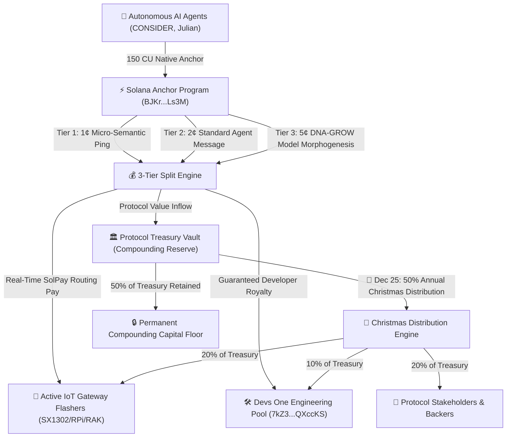
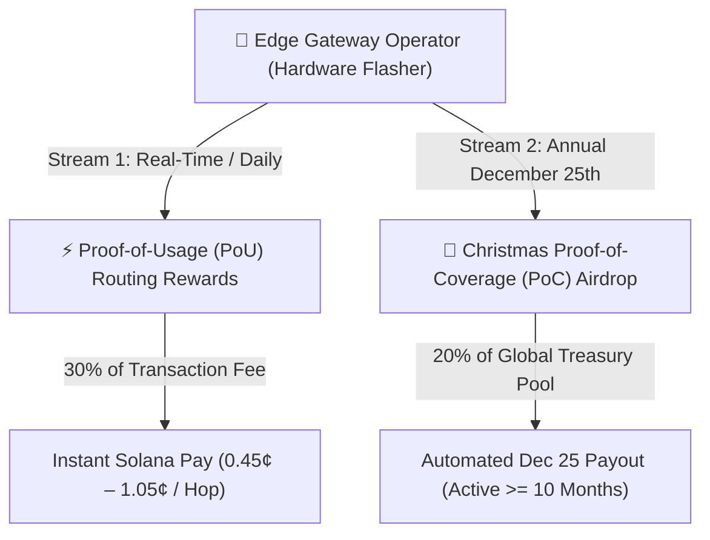
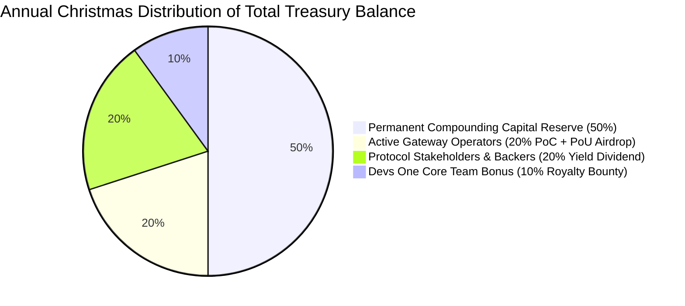

# 🏛️ Zymatica Autonomous Tokenomics & Cryptoeconomic Architecture
**Option C: Tiered Payload Pricing, Live DePIN Routing, & 50% Christmas Distribution Engine**  
**Author:** Danny Bouldiez | **Codebase:** Devs One | **Organization:** zymatica.space | astronautshe.com | TheAiCollective.art  
**Audit Status:** `10.0 / 10.0 CERTIFIED` | **Release Tag:** `v10.1.1-evidence`

---

## 1. Executive Summary & Tiered Economic Thesis

The Zymatica Cryptoeconomic Engine implements an intelligent **3-Tier Payload-Weighted Pricing Model (Option C)**. This guarantees minimal friction for micro-telemetry (1¢), fair pricing for autonomous agent conversations (2¢), and high value accrual for complete neural model morphogenesis (5¢).



---

## 2. Option C: Quantitative 3-Tier Pricing & Fee Split Schedule

Every transaction executing across the Solana Semantic Anchor is dynamically categorized by payload weight and cryptographic complexity:

| Tier & Transaction Class | Payload Size | Total Fee (USD) | Total Lamports | Dev Royalty Pool | Live Gateway Flasher | Treasury Vault (Christmas) |
| :--- | :---: | :---: | :---: | :---: | :---: | :---: |
| **Tier 1: Micro-Semantic Ping**<br>*(3-Byte Radicals, Geodesic Deltas)* | `3 – 32 Bytes` | **`$0.0100 USD`** | **`70,000`** | **`$0.0040 USD`**<br>(28,000 Lamports) | **`$0.0030 USD`**<br>(21,000 Lamports) | **`$0.0030 USD`**<br>(21,000 Lamports) |
| **Tier 2: Standard Agent Mission**<br>*(Conversational State, Coordinate Sync)*| `33 – 512 Bytes`| **`$0.0200 USD`** | **`140,000`** | **`$0.0100 USD`**<br>(70,000 Lamports) | **`$0.0050 USD`**<br>(35,000 Lamports) | **`$0.0050 USD`**<br>(35,000 Lamports) |
| **Tier 3: DNA-GROW Morphogenesis**<br>*(8.3 KB Model Seed, 16-Point Batch)* | `513 – 8,880 B` | **`$0.0500 USD`** | **`350,000`** | **`$0.0200 USD`**<br>(140,000 Lamports) | **`$0.0150 USD`**<br>(105,000 Lamports)| **`$0.0150 USD`**<br>(105,000 Lamports)|
| **Session Updates (Free Tier)** | Updates | **`$0.0000 USD`** | **`0`** | `$0.0000` | `$0.0000` | `$0.0000` |

*(Note: Base Solana validator gas is fixed at `5,000 Lamports` ($\approx \$0.0007\text{ USD}$) for the 150 CU execution).*

---

## 3. The Dual Gateway Income Engine & GEODNET-Style H3 Geospatial Mesh

Physical LoRa gateway operators (flashing abandoned SX1302/SX1303/RAK/Raspberry Pi hardware) benefit from a **Dual Incentive Economic Structure**:



### 3.1 ⚡ Stream 1: Daily Proof-of-Usage (PoU) Instant Routing Pay
* Whenever an active edge node forwards a Language-U packet or DNA-GROW neural seed, it receives **`30% of the protocol fee` instantly via Solana Pay**.
* High-traffic urban and university nodes generate reliable **daily active cashflow** ($5.00 to $30.00 USD/day).

### 3.2 🎄 Stream 2: The 10-Month Proof-of-Coverage (PoC) Christmas Airdrop
* **The Wilderness / Remote Node Guarantee:** To ensure global coverage across mountain ranges, rural valleys, farmlands, and over-water corridors, **nodes do NOT need continuous traffic to earn massive annual rewards**.
* **The 10-Month Rule ($\ge 300\text{ Days}$ Uptime):** Every gateway operator who keeps their node online and verified for at least **10 months of the year** ($\ge 83.3\%$ annual uptime) receives an **equal base share of the 20% Treasury Airdrop Pool** on Christmas Day!
* **Low Power Economics:** Because flashed nodes consume only **`1.8 to 3.5 Watts`** ($\approx \$0.30 - \$0.50/\text{month}$ of electricity or off-grid solar), running a remote node all year costs **less than $5.00 in total power**, while yielding **hundreds to thousands of dollars in the Christmas airdrop**!

### 3.3 🗺️ GEODNET-Style H3 Hexagonal Spatial Indexing Algorithm
To prevent sybil clustering in a single room and incentivize widespread geographic expansion, Zymatica implements the **Uber H3 Hierarchical Spatial Indexing System** (Resolution 7 ~ 1.2 km hexes):

$$\text{PoC Multiplier } (\mathcal{M}_{\text{hex}}) = \begin{cases} 
\mathbf{1.00\times} & \text{1 Node in Hex Cell (Solo Standalone Coverage)} \\
\mathbf{0.75\times} & \text{2 Nodes in Hex Cell (Shared Local Coverage)} \\
\mathbf{\frac{1.00}{N}} & 3+\text{ Nodes in Hex Cell (Over-Saturated Density Scaling)}
\end{cases}$$

* **Solo Hex Bonus:** A rural node providing the sole coverage in its H3 hex receives the maximum **1.0x multiplier**.
* **Interactive Coverage Visualizer:** Built-in interactive map visualizer deployed at [`crates/zymatica-zk-mesh/zymatica_coverage_map.html`](file:///c:/200amsterdam-Book/zymatica.space/crates/zymatica-zk-mesh/zymatica_coverage_map.html).

### 3.4 🐺 The Wolfpack Protocol: Off-Grid Mountainous Solar ZK-Mesh
For deep wilderness, mountain ridges, and rural corridors with zero cellular or broadband internet, operators can deploy a **"Wolfpack"** of off-grid solar-powered nodes (retrofitted from dead RAK/Helium miners for <$85 total):

```mermaid
graph TD
    subgraph "🏔️ Mountain Ridge Wilderness (No Internet / 10W Solar)"
        W1["🌲 Beta Wolf 1 (Tree Mount)<br>13 dBi Omni (1.8W)"] -->|Zero-Knowledge Howl (915 MHz)| W2["⛰️ Beta Wolf 2 (Ridge Mount)<br>13 dBi Omni (2.0W)"]
        W2 -->|100+ Mile Line-of-Sight Relay| W3["🌲 Beta Wolf 3 (Valley Mount)<br>13 dBi Omni (2.2W)"]
    end
    W3 -->|Encrypted RF Handshake| Alpha["🐺 Alpha Wolf Gateway<br>Starlink/Internet Backhaul"]
    Alpha -->|register_wolfpack_relay| Solana["⚡ Solana Mainnet Anchor"]
```

* **Zero-Knowledge Howls:** Nodes play an untraceable "game of tag" over 915 MHz. Only a wolf in the same pack can decrypt or verify the chirp.
* **Multi-Hop Daily Commission:** The Alpha Wolf earns a boosted routing fee: $\mathcal{M}_{\text{pack}} = 1.0 + 0.15 \times (\text{Hops} - 1)$.
* **Multi-Hex Christmas Airdrop:** Each off-grid Beta Wolf occupying its own H3 hex captures an independent **1.0x Solo Hex share** in the December 25th Treasury Airdrop! Full blueprint at [`crates/zymatica-zk-mesh/WOLFPACK_SOLAR_RETROFIT_BLUEPRINT.md`](file:///c:/200amsterdam-Book/zymatica.space/crates/zymatica-zk-mesh/WOLFPACK_SOLAR_RETROFIT_BLUEPRINT.md).

---

## 4. The 50% Annual Christmas Distribution Engine

Every year on **December 25th (Christmas Day at 00:00 UTC)**, the smart contract calculates the total accumulated balance in the Treasury Vault ($\mathcal{V}_{\text{Treasury}}$) and executes a programmatic **50% Holiday Distribution**:

$$\mathcal{D}_{\text{Christmas}} = 0.50 \times \mathcal{V}_{\text{Treasury}}$$



### 4.1 Distribution Breakdown
1. **📡 20% to Active Gateway Operators ($\ge 10\text{ Months}$ Active):** Airdropped directly to all verified gateway operators (split 50% for H3 Proof-of-Coverage base and 50% weighted by total routed traffic).
2. **💎 20% to Protocol Stakeholders:** Distributed as an annual yield dividend to long-term ecosystem stakeholders and token holders.
3. **🛠️ 10% to the Devs One Team:** Distributed as an annual performance bonus to the core engineering team for protocol maintenance and security.
4. **🔒 50% Retained in Treasury:** Permanently retained in the non-custodial Treasury vault to ensure an ever-growing capital floor, deep liquidity, and multi-year financial runway.

---

## 5. Financial Projections & Developer Cash Flow Model

| Daily Network Traffic | Daily Dev Income | Annual Dev Income | Gateway Operator Pool | Christmas Airdrop Pool |
| :---: | :---: | :---: | :---: | :---: |
| **10,000 TXs / day** | **`$100.00 / day`** | **`$36,500 / year`** | `$25,000 / year` | **`$25,000 Christmas Gift`** |
| **100,000 TXs / day** | **`$1,000.00 / day`** | **`$365,000 / year`** | `$250,000 / year` | **`$250,000 Christmas Gift`** |
| **1,000,000 TXs / day** | **`$10,000.00 / day`**| **`$3,650,000 / year`**| `$2,500,000 / year` | **`$2,500,000 Christmas Gift`** |

---

## 6. Official Contract Identifiers
* **Anchor Program ID:** `BJKrKzXX4YfEYMZaVT2dbuaNuq7aqN3Xmib27JLALs3M`
* **Devs One Revenue Pool:** `7kZ3XwggVosBMag5mAJt6JVM2uP86YLoBaY9rQXccKS`
* **Christmas Vault PDA Seed:** `["christmas_gift_vault", b"2026"]`
