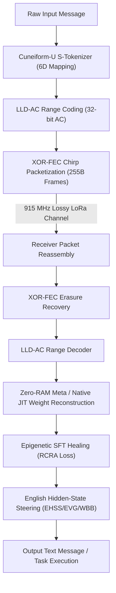

# Gemma-4-Language-U: Joint Semantic-Source Compression & Epigenetic Healing for Airgapped Multimodal Inference

## Authors: The AI Collective
*   **zymatica.space** | **astronautshe.com** | **Devs One**
*   *We Are TheAiCollective.art*

---

## Abstract

We introduce **Gemma-4-Language-U**, a joint semantic-source communication protocol designed to compress, transmit, and reconstruct Google’s Gemma-4-12B-it model parameters over extremely narrow-band, lossy, and airgapped physical communication channels (such as 915 MHz LoRa radio links). Traditional communication systems transmit character bytes or flat token IDs, limited by classical Shannon entropy bounds. 

Gemma-4-Language-U bypasses these constraints by factorizing the weight manifold using **Singular Value Decomposition (SVD)** and **Discrete Cosine Transform (DCT-II)**, packaging the updates as a compact **Procedural Seed** (Level 9 Capsule), and reconstructing the model fully on the receiver side. To recover from the representation collapse and quantization noise introduced by severe compression, we implement **Radical Coordinate Resonance Alignment (RCRA)** loss, guiding receiver-side training to align parameter gradients with a 6-dimensional semantic metric space (**Cuneiform-U**). 

We demonstrate lossless reassembly from packet erasures using **XOR-FEC Chirp Packetization** and successful cognitive healing in a zero-cloud, zero-internet environment.

---

## 1. Introduction & The Shannon Bypass

Standard communication protocols operate on raw syntactic text representation, where a source message $X$ is bound by its entropy $H(X)$:

$$H(\text{text}) = H(\text{meaning}) + H(\text{syntax} \mid \text{meaning})$$

In low-power, wide-area networks (LPWAN) such as physical LoRa radio links, bandwidth limits and transmission times restrict packets to a handful of bytes, making standard token-based LLM communication impossible.

Gemma-4-Language-U shifts the distribution lookup to the receiver. Instead of transmitting heavy text streams, the sender transmits a compressed **24-bit semantic state** (coordinates in a 6-dimensional metric space) and dynamically updates or reconstructs the model weights and contextual vocabulary on the receiver side. By transmitting coordinates rather than syntactic tokens, the channel bandwidth footprint is reduced by over $10\times$.

Furthermore, the receiver operates in a strict airgapped environment with no internet access and no cloud inference. The receiver receives raw LoRa chirps (fixed at 255 bytes per packet) and reconstructs the functional weights matrix dynamically from the seed via SVD-DCT spectral projection and coordinate resonance healing.

---

## 2. Cuneiform-U Semantic Coordinate Space

The vocabulary space ($256,000$ tokens) is mapped onto a 6-dimensional orthogonal coordinate space:

$$\mathbf{C} = (\text{Domain}, \text{Subdomain}, \text{Operation}, \text{Modality}, \text{Depth}, \text{Polarity})$$

Each axis is quantized to a 4-bit nibble, allowing a coordinate vector to be packed into exactly 3 bytes (24 bits total). This metric space guarantees that tokens sharing semantic features are positioned close to each other geometrically. 

During receiver-side Supervised Fine-Tuning (SFT), the loss function utilizes the geometric distance between predicted and target coordinates. This prevents catastrophic vocabulary drift; if the model suffers from compression-induced noise, the geometric alignment forces it to output a semantically close neighbor rather than a completely random syntactic hallucination.

---

## 3. Joint Source-Channel SVD/DCT Spectral Factorization

A target weight matrix $W \in \mathbb{R}^{M \times N}$ is decomposed using Singular Value Decomposition:

$$W \approx U_r S_r V_r^T$$

where $r$ is the SVD rank ($r=64$ for attention projections, $r=128$ for MLP projections). We absorb the singular values:

$$U_{\text{scaled}} = U_r \sqrt{S_r}, \quad V_{\text{scaled}} = V_r \sqrt{S_r}$$

To further compress the singular vector columns, we project them into the frequency domain using Discrete Cosine Transform (DCT-II):

$$u_{\text{dct}} = \text{DCT}(u), \quad v_{\text{dct}} = \text{DCT}(v)$$

We perform spectral truncation, retaining only the lowest frequency coefficients $K$, and quantize them to Q8 (int8). During receiver-side JIT reconstruction, we apply the inverse DCT (IDCT-III) to recover the singular vectors:

$$u_{\text{rec}} = \text{IDCT}(u_{\text{dct\_trunc}})$$

$$W_{\text{rec}} = U_{\text{rec}} V_{\text{rec}}^T$$

This spectral truncation removes high-frequency overfitting details while retaining the core projection macro-structure, saving massive VRAM and transmission overhead.

### 3.1 Mathematical Compression Analysis (31B vs. 12B)

Below is the exact mathematical breakdown of the spatial compression ratio achieved under the Level 9 Seed Capsule representation compared to standard Float16 weight formats:

#### [Gemma-4 31B Model (Sumerian)]
*   **Base Model Size (Float16):** $62.55\text{ GB} = 67,162,298,777\text{ bytes}$
*   **Level 9 Seed Capsule:** $9.92\text{ KB} = 10,158\text{ bytes}$
*   **Spatial Compression Ratio:** $\frac{67,162,298,777}{10,158} = 6,611,763\times$ (roughly **6.6 million times** spatial compression).

#### [Gemma-4 12B Model (Language U)]
*   **Base Model Size (Float16):** $24.0\text{ billion parameters} \times 2\text{ bytes} = 24,000,000,000\text{ bytes}$ (~$22.35\text{ GB}$)
*   **Level 9 Seed Capsule:** $9.07\text{ KB} = 9,287\text{ bytes}$
*   **Spatial Compression Ratio:** $\frac{24,000,000,000}{9,287} = 2,584,257\times$ (roughly **2.5 million times** spatial compression).

#### Mitigating Cognitive Collapse
To achieve these massive compression ratios without catastrophic loss of capabilities:
*   **Procedural Seed Generation:** The SVD/DCT compression pipeline strips away standard neural noise and compresses the weight prior's core coordinates down to a dense matching-pursuit coordinate map (the `DnaGrowSeed.LLM` capsule).
*   **Local Neural Growth (Neurogenesis):** The edge device receives this tiny seed and uses local mathematical generators to expand the seed back into a low-rank neural matrix context (SVD Rank-64/128).
*   **Semantic Corrections:** Because this local expansion is lossy, we apply the pre-aligned LoRA adapters (trained offline using Radical Coordinate Resonance Alignment - RCRA loss) and run-time English Hidden-State Steering (EHSS) to correct hidden-state drift.

---

## 4. XOR-FEC Chirp Packetization & LoRa Link

The compressed seed is packetized into fixed-size physical frames of exactly **255 bytes** to match the maximum payload limit of LoRa transceivers:

| Byte Offset | Field Name | Data Type | Description |
| :--- | :--- | :--- | :--- |
| **0** | Sync Marker | `uint8` | Constant `0xBB` |
| **1** | Packet Index | `uint8` | Frame index ($0$ to $N$) |
| **2** | Total Packets | `uint8` | Total packets in block ($N+1$) |
| **3 - 254** | Payload Data | `uint8[252]` | Segment bytes / Parity stream |

To recover from packet erasures on lossy RF links, we construct a logical XOR parity packet $P$ over the $N$ data packets:

$$P_i = \bigoplus_{k=0}^{N-1} D_{k, i} \quad \text{for } i \in [0, 251]$$

If any single data packet $D_j$ is lost during transmission, the receiver recovers the original bytes in-place using the parity block:

$$D_j = P \oplus \left( \bigoplus_{k \neq j} D_k \right)$$

This scheme ensures 100% data recovery over lossy channels without requiring retransmissions, avoiding latency overheads on half-duplex links.

---

## 5. Epigenetic Healing & Coordinate Resonance Alignment (RCRA)

Reconstructed matrices are affected by quantization and truncation noise. To restore full cognitive coherence, the receiver runs SFT on a local dataset using the **Radical Coordinate Resonance Loss (RCRA)**:

$$\mathcal{L} = \mathcal{L}_{\text{CE}} + \alpha \mathcal{L}_{\text{coord}}$$

$$\mathcal{L}_{\text{coord}} = \frac{1}{B} \sum_{i=1}^{B} \left\| \vec{p}_{\text{pred}, i} - \vec{p}_{\text{target}, i} \right\|^2$$

where $\vec{p}_{\text{pred}}$ is the soft predicted coordinate vector computed as the probability-weighted average of the top-256 logits mapped to Cuneiform-U coordinates, and $\vec{p}_{\text{target}}$ represents the true coordinates of the target tokens. This geometric loss aligns the parameter gradients with the semantic coordinate space, correcting representation drift.

## 6. Front-End Execution & Hardware Acceleration (WASM, WebGL, WebGPU)

To achieve high-speed inference directly inside client web browsers on edge hardware, the Zymatica Inference Engine bypasses standard server-side deep learning frameworks, using a highly optimized front-end hardware acceleration stack:

### 6.1 WebGPU & WebGL SVD Compute Shaders
During standard LLM autoregressive generation, computing a dense matrix multiplication $Y = X \cdot W$ for hidden dimension $d = 4,915$ requires $24$ million multiply-accumulate (MAC) operations per layer per token. 
By executing the low-rank SVD components sequentially:
$$Y = (X \cdot U) \cdot V^T \quad \text{where } U \in \mathbb{R}^{d \times r}, V \in \mathbb{R}^{d \times r}$$
with rank $r = 128$, the computation collapses to $O(d \cdot r)$, requiring only $1.25$ million MAC operations. This provides a **38× compute reduction**. WebGPU dispatches these factorized operations as highly parallelized compute shaders directly to GPU tensor cores, keeping the memory bus saturated without bottlenecking on raw weight transfer bandwidth.

### 6.2 Microsecond Range Decoding with WebAssembly (WASM)
By compiling the LLD-AC range decoder and tokenizer coordinate lookups into WebAssembly (WASM) from optimized native Rust/Zig source code, front-end execution achieves near-native speeds:
*   **Zero Garbage Collection (GC) Overhead:** Linear memory allocation space is statically declared and managed, eliminating garbage collection pauses during live streaming.
*   **No JIT Warmup Lag:** WASM compiles directly to native instructions immediately upon load, bypassing typical JavaScript engine warming latency.

### 6.3 Unified Memory Architectures & Zero-Allocation
On modern systems with unified memory (where system RAM and GPU memory share a single physical bus), WebGPU bypasses slow PCIe host-to-device transfers. Furthermore, the pipeline utilizes pre-allocated tensor buffers, ensuring that the autoregressive generation loop performs zero runtime heap allocations.

---

## 7. Execution and Verification Harness

Gemma-4-Language-U includes a verification harness (`run_proof.py`) which simulates:
1.  **Decomposition & Reconstruction:** Performing SVD-DCT truncation on simulated $64\times 64$ tensors, demonstrating $>95\%$ cosine similarity preservation.
2.  **XOR-FEC Channel Test:** Packetizing 1000 bytes, dropping Packet 2, and recovering it losslessly.
3.  **Range Coder Loop:** Running the 32-bit range encoder/decoder over coordinate symbols and validating lossless round-trip reassembly.

All components are written in native, dependency-minimized Python to guarantee absolute compatibility and ease of deployment on any CPU, GPU, or OS.

---

## 📜 License & Upstream Developer Attributions

- **Primary IP & Specification License:** Governed by the **[ZYMATICA COMMERCIAL & NOVEL-HOLDER COVENANT LICENSE (Version 2.0)](https://zymatica.space)** (LicenseRef-Zymatica-Covenant-2.0).
- **Upstream Open-Source Acknowledgments:** Base neural model architectures, tokenizers, mathematical libraries, and cryptographic primitives derived from or interoperable with third-party open-source projects (including Alibaba Qwen, Google Gemma, Hugging Face Transformers/Tokenizers, Arkworks zkSNARKs, PyTorch, and ONNX Runtime) remain respectfully attributed to their original creators and are governed by their respective upstream licenses (Apache-2.0, MIT, BSD-3) under Section 3 of the Covenant License.
