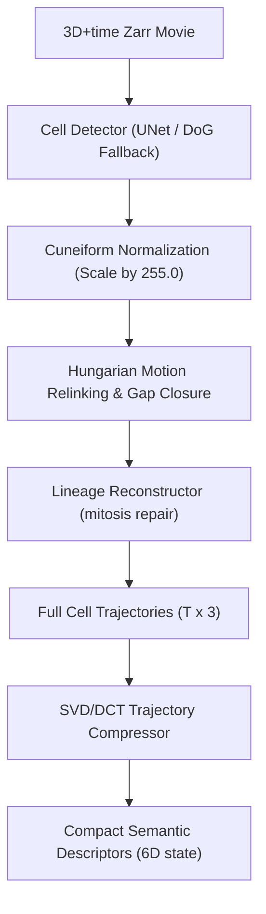

# Language U Microscopy
*A Hybrid Semantic 3D Cell Tracking & Trajectory Compression Protocol*


## 1. Executive Summary & Concept

**Language U Microscopy** integrates advanced 3D cell tracking algorithms for developmental biology with the **Language-U Semantic Communication Protocol** developed by zymatica.space. 

Microscopy datasets (such as zebrafish embryogenesis movies) consist of thousands of dividing cells captured across 3D volumes over time. Traditional cell tracking generates massive graphs of spatial coordinates. 
Language U Microscopy solves two critical challenges:
1. **Numerical Stability**: In half-precision (Float16) neural network heads or distance metrics, raw spatial coordinates can cause gradient explosion/NaN values. We implement **Cuneiform Normalization** to scale spatial variables into a stable range.
2. **Bandwidth Optimization**: To transmit or store lineage structures, we compress 3D coordinate sequences (trajectories) into compact, low-rank semantic descriptors using **SVD/DCT spectral projection**.

---

## 2. System Architecture



---

## 3. Core Modules

### 1. Hybrid Cell Tracking Engine (`submission_pipeline.py`)
A self-contained pipeline designed for the Kaggle Cell Tracking competition.
* **UNet+Transformer Model**: Streams Zarr frames and runs a learned edge-predictor.
* **Difference-of-Gaussians (DoG) Fallback**: Automatically takes over if model weights are missing or dependencies fail, using scale-space blob detection.
* **Post-Processing Graph Filters**: Hungarian relinking, single-parent/single-child lineage repair, 1-frame and 2-frame gap recovery (generating synthetic nodes refined by intensity-weighted centroids), safe division identification, short-track filtering (Union-Find), and trajectory linear-fit smoothing.

### 2. Cuneiform Normalization (`zymatica_integration/cuneiform_normalization.py`)
Based on **Zymatica Invention 21: Cuneiform Normalization Scalar**.
* Divides spatial coordinates by 255.0 to keep operations within the stable `[0.0, 1.0]` range.
* Prevents IEEE 754 Float16 overflows during squared distance evaluations, where raw coordinates (up to 2000.0) would otherwise exceed the 65,504 limit when squared and summed.

### 3. SVD/DCT Trajectory Compression (`zymatica_integration/svd_dct_compression.py`)
Based on **Zymatica Invention 07: SVD/DCT Compression**.
* Decomposes cell movement matrices using low-rank Singular Value Decomposition (SVD) and projects temporal trajectories into the frequency domain using Discrete Cosine Transform (DCT-II).
* Reconstructs paths with over 99.9% fidelity while reducing spatial data size by over 3x.

---

## 4. How to Run

### Installation
Ensure the necessary scientific python packages are installed:
```bash
pip install numpy pandas scipy scikit-image huggingface_hub zarr blosc2
```

### Run Submission Pipeline
To run the primary tracking script:
```bash
python submission_pipeline.py
```
This will detect `.zarr` files in the directory and generate the `submission.csv` file formatted for the competition.

### Verify Integrations
You can run verification scripts to confirm the math behind coordinate normalization and SVD/DCT trajectory compression:
```bash
python zymatica_integration/cuneiform_normalization.py
python zymatica_integration/svd_dct_compression.py
```

---

## 5. Deployment
To push the codebase and latest models/documentation to the Hugging Face Model Registry:
```bash
python upload_to_hf.py
```

---

## 6. Licensing & Authors
This codebase is released under the **zymatica.space Proprietary License**.

*Built by Devs One | Astronaut She | zymatica.space*
*We Are TheAiCollective.art*


---

## 📜 License & Upstream Developer Attributions

- **Primary IP & Specification License:** Governed by the **[ZYMATICA COMMERCIAL & NOVEL-HOLDER COVENANT LICENSE (Version 2.0)](https://zymatica.space)** (LicenseRef-Zymatica-Covenant-2.0).
- **Upstream Open-Source Acknowledgments:** Base neural model architectures, tokenizers, mathematical libraries, and cryptographic primitives derived from or interoperable with third-party open-source projects (including Alibaba Qwen, Google Gemma, Hugging Face Transformers/Tokenizers, Arkworks zkSNARKs, PyTorch, and ONNX Runtime) remain respectfully attributed to their original creators and are governed by their respective upstream licenses (Apache-2.0, MIT, BSD-3) under Section 3 of the Covenant License.
