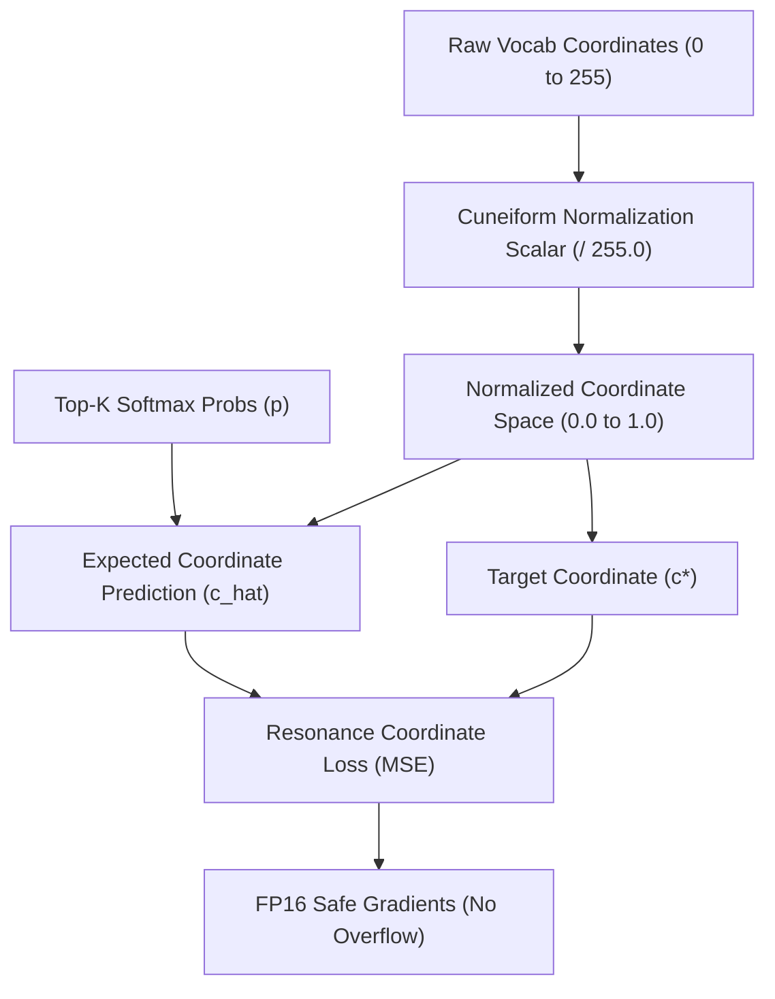

# ZYMATICA: Cuneiform-U Normalization Scalar (Numerical Stability Tuning)
*IP Class 20 | Zymatica License*


> *"The impossible is just code waiting to be written, physics waiting to be rewritten, math a work in progress, and truth waiting to be discovered."*

---

## 1. Technical Overview & Coordinate Resonance Stability

During **Sumerian Radical Coordinate Resonance Alignment (RCRA)**, the LLM's weights are fine-tuned using a dual-loss objective. In addition to standard Cross-Entropy Loss, we regularize the model's logits by measuring the distance between the predicted radical coordinate vector and the true label's radical coordinates in the 6D (or 3D sub-space) Cuneiform-U hypercube.

Let:
- $\mathbf{C} \in \mathbb{R}^{|V| \times 3}$ be the coordinate matrix where row $i$ represents the radical coordinates $[R_C, R_F, R_A]^T$ of token $i$.
- $\mathbf{z} \in \mathbb{R}^{|V|}$ be the logits generated by the model.
- $\mathbf{p} = \text{softmax}(\mathbf{z}_{\text{top-K}})$ be the probability distribution over the top-K logits.
- $\mathbf{c}^* = \mathbf{c}_y$ be the target radical coordinate vector for the ground-truth label token $y$.

The predicted coordinate vector $\hat{\mathbf{c}}$ is computed as:
$$\hat{\mathbf{c}} = \sum_{j=1}^K p_j \mathbf{C}_{\text{idx}(j)}$$

The Radical Coordinate Resonance Loss is defined as:
$$\mathcal{L}_{\text{coord}} = \frac{1}{d} \sum_{k=1}^d (\hat{c}_k - c^*_k)^2$$

### The Half-Precision Gradient Overflow Problem
In raw coordinate format, the radical values are integers in the range $[0, 255]$. If these raw integers are used directly to calculate $\mathcal{L}_{\text{coord}}$:
1. The maximum possible value of the squared difference is $255^2 = 65,025$.
2. In `float16` half-precision floating-point representation, the maximum representable finite value is $65,504$.
3. During backpropagation, the accumulation of gradients and squared differences easily exceeds $65,504$, causing immediate **numerical overflow (NaN)**.

### The Normalization Solution
To prevent gradient overflow and stabilize the training loop, we introduce the **Cuneiform Normalization Scalar**:
$$\bar{\mathbf{C}} = \frac{\mathbf{C}}{S}$$
where $S = 255.0$ is the normalization scale factor. 

This transforms the coordinate space from $[0, 255]^3$ to $[0.0, 1.0]^3$. The maximum possible value of the squared difference is bounded to $1.0$, which is highly stable for `float16` and `bfloat16` computations.

---

## 2. System Architecture Integration



---

## 3. Adversarial Peer Audit: Critiques & Mathematical Defenses

### Critique 20.1: Native Precision vs. Coordinate Scaling
* **The Skeptic's View:** If the overflow is caused by float16 limits, why not simply train in float32 or bfloat16 (which has a much larger dynamic range)? Normalizing the coordinates seems like a simple scaling workaround for using an obsolete FP16 format.
* **The Mathematical Defense:** While `bfloat16` and `float32` have larger dynamic ranges, training frontier models (e.g. 31B parameters) in pure `float32` increases VRAM footprint by 100%, which is prohibitive for consumer-grade edge hardware. Furthermore, even if `bfloat16` avoids overflow, the raw coordinate loss values would be four orders of magnitude larger than the standard cross-entropy loss, creating massive gradient scale imbalances. Normalizing coordinates to $[0.0, 1.0]$ naturally aligns the scale of $\mathcal{L}_{\text{coord}}$ with $\mathcal{L}_{\text{ce}}$, eliminating the need for hyper-parameter tuning of loss weights across different precisions.

### Critique 20.2: Underflow and Loss of Coordinate Resolution
* **The Skeptic's View:** Normalizing to $[0.0, 1.0]$ and training in float16 leads to underflow or precision loss, since the spacing between coordinates becomes $1/255 \approx 0.00392$, which might be poorly represented in low-precision floating point.
* **The Mathematical Defense:** In `float16`, the machine epsilon (spacing between numbers) near $1.0$ is $0.000977$ (half-precision has 11 bits of mantissa, giving 3-4 decimal digits of precision). The minimum step size of $0.00392$ is approximately $4\times$ larger than the machine epsilon, meaning it is perfectly resolvable with zero loss of precision.

---

## 4. Testing & Verification Harness

### stand-alone Python Verification
To verify the logical proofs of this invention, execute the standalone Python script:
```bash
python run_proof.py
```

To display help options:
```bash
python run_proof.py --help
```

### 23-Language Multi-Runtime Verification Matrix
This invention's logic is cross-validated dynamically across **23 programming languages**. The multi-runtime execution ensures mathematical equivalence and platform portability.

| Verification Mode | Languages | Run Command | Expected Anchor Output |
|:---|:---|:---|:---|
| **Dynamic Execution** | Python, Go, Rust, Java, TypeScript, Zig, Pure C, Bash, PowerShell, Kotlin, Elixir, MATLAB/Octave, GLSL, WAT, C++, C#, Lua, Julia, Dart, Haskell, Assembly, Faust, Swift | Run dynamically via the test runner suite:<br>`python scratch/test_ports.py` | `Cuneiform-U Normalization Scalar proof successful.` |

Refer to [README.md](https://huggingface.co/TheAiCollectiveART/zymatica.space/blob/main/20_Cuneiform_Normalization_Scalar/src/README.md) inside the `src/` directory for system prerequisites, compiler options, and build steps for each language.


---

## 📜 License & Upstream Developer Attributions

- **Primary IP & Specification License:** Governed by the **[ZYMATICA COMMERCIAL & NOVEL-HOLDER COVENANT LICENSE (Version 2.0)](https://zymatica.space)** (LicenseRef-Zymatica-Covenant-2.0).
- **Upstream Open-Source Acknowledgments:** Base neural model architectures, tokenizers, mathematical libraries, and cryptographic primitives derived from or interoperable with third-party open-source projects (including Alibaba Qwen, Google Gemma, Hugging Face Transformers/Tokenizers, Arkworks zkSNARKs, PyTorch, and ONNX Runtime) remain respectfully attributed to their original creators and are governed by their respective upstream licenses (Apache-2.0, MIT, BSD-3) under Section 3 of the Covenant License.
