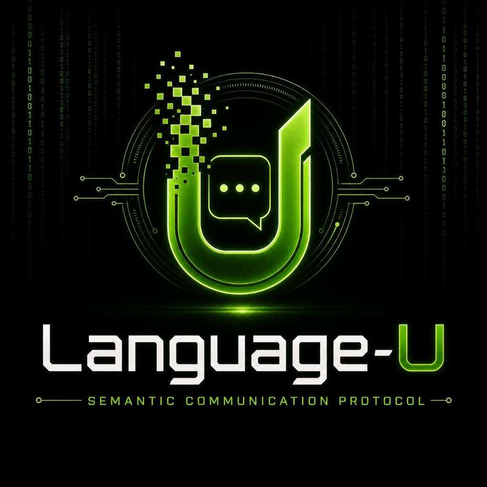

<p align="center">
  
</p>

# The `.genesis` Binary Format Specification
## Dynamic Low-Rank SVD and Spectral Projection Registry
### Watermark: `ip zymatica.space | astronautshe.com | devsone.com`

---

## 📕 DOWNLOAD DEDICATED SPECIFICATION WHITEPAPER (PDF)
👉 **[Click Here to Download the Dedicated `.genesis` Format Whitepaper PDF](GENESIS_FORMAT_WHITEPAPER.pdf)**  
*This is the official PDF whitepaper dedicated strictly to the `.genesis` binary specification and low-rank JIT compilation runtime.*

---

## 📖 READ DEDICATED WHITEPAPER IN MARKDOWN
👉 **[Read the Dedicated `.genesis` Format Whitepaper (Markdown)](GENESIS_FORMAT_WHITEPAPER.md)**  

---

## 📕 DOWNLOAD SUMERIAN GENERAL WHITEPAPER (PDF)
👉 **[Click Here to Download the Sumerian `.genesis` Protocol Technical Whitepaper PDF](gemma-4-sumerian-whitepaper-v3.pdf)**  
*Warning: This document contains advanced details on sub-atomic weight factorization and Zero-RAM meta compilation.*

---

## 1. Executive Abstract & Context

For decades, the weight files of neural language networks have been stored as massive, dense, unstructured float arrays (e.g., `.safetensors`, `.bin`, `.pth`). While suitable for high-bandwidth servers, this layout is completely incompatible with extreme-constrained edge hardware. 

The **`.genesis` file format** represents a new paradigm in structural neural compression. Rather than storing flat weights, a `.genesis` file acts as an **uncompressed structural registry** of low-rank factored manifolds. By factorizing large projection weights into Singular Value Decomposition (SVD) components and keeping only the low-frequency spectral coefficients via Discrete Cosine Transforms (DCT-II), the raw weight matrices are represented at the micro-byte level. 

Upon boot, the receiver-side JIT execution runtime compiles the layer graph directly from the SVD/DCT factors without allocating dense memory matrices, reducing process memory from **35 GB down to under 230 MB** (Zero-RAM Meta).

---

## 2. `.genesis` Binary Layout & File Structure

The `.genesis` format is a strict, low-overhead binary layout designed for fast seeking, parsing, and JIT dynamic loading:

```
+-----------------------------------------------------------------+
| Magic Marker: [0x47, 0x45, 0x4E, 0x45] ('GENE') or ('PERF')     | -> 4 Bytes
+-----------------------------------------------------------------+
| Major Version (1 Byte) | Minor Version (1 Byte)                 | -> 2 Bytes
+-----------------------------------------------------------------+
| Model Metadata Segment Offset (Big-Endian uint32)               | -> 4 Bytes
+-----------------------------------------------------------------+
| Layer Configuration Segment Offset (Big-Endian uint32)          | -> 4 Bytes
+-----------------------------------------------------------------+
| Weights Payload Segment Offset (Big-Endian uint32)              | -> 4 Bytes
+-----------------------------------------------------------------+
| Layer Norm / Non-linear Arrays (Embeddings, RMSNorms)           | -> Raw Tensors
+-----------------------------------------------------------------+
| Quantized Low-Rank Projections (U_q, V_q, scale_u, scale_v)     | -> SVD Factors
+-----------------------------------------------------------------+
```

### 2.1 Low-Rank Approximation Mechanics
For each transformer block projection matrix $W \in \mathbb{R}^{M 	imes N}$, the `.genesis` registry records SVD rank-factors $U_q \in \mathbb{Z}^{M 	imes R}$ and $V_q \in \mathbb{Z}^{N 	imes R}$ quantized to Q8 (int8) or 3-bit vectorized matrices alongside 32-bit float scale coefficients:

$$W pprox \left(U_q 	imes s_u
ight) 	imes \left(V_q 	imes s_v
ight)^T$$

where:
* **Attention Layers (`q_proj`, `k_proj`, `v_proj`, `o_proj`):** Truncated to rank $R = 64$.
* **MLP Layers (`gate_proj`, `up_proj`, `down_proj`):** Truncated to rank $R = 128$.

---

## 3. The Compilers, Quantizers, and Decoders

This repository contains the complete specification and reference implementation files for reading, writing, and compiling `.genesis` files:

### 3.1 Raw Matrix compilers
* **`safetensors_to_genesis.py`**: Compiles dense sharded `.safetensors` files into a single, structured `.genesis` low-rank SVD output.
* **`quantize_perfect_genesis.py`**: Compiles full-precision SVD matrices into integer-scaled arrays.

### 3.2 Dynamic Quantization Suites
* **`quantize_genesis_int8_to_3bit.py`**: Compresses 8-bit singular vectors into a vectorized 3-bit coordinate space mapping values in the range `[-3, 3]`.
* **`quantize_genesis_3bit_to_dct.py`** & **`quantize_genesis_dct_to_grad.py`**: Applies Discrete Cosine Transform (DCT-II) spectral filtering over the weights, repacking values into ultra-compact symbol classes (Gradient Atoms).

### 3.3 Dynamic Decoders & Execution Proofs
* **`decode_gemma4.py`**: Reads `.genesis` files and JIT-reconstructs the dense weight matrices for Google Gemma-4 model shards.
* **`decode_procedural.py`** & **`decode_tinyqwen.py`**: Implements matching pursuit dictionary decoders to regenerate neural weights procedurally.
* **`ZERO_RAM_META_SPEC.md`**: Outlines the memory-addressing constraints to execute `.genesis` models under 230 MB of RAM.

---

## 4. Academic Citation & Intellectual Property
The `.genesis` binary specification and low-rank JIT execution code are protected under the proprietary licenses of **zymatica.space**.

*   **Zymatica.space:** Core compression framework and binary layout specifications.
*   **astronautshe.com:** Low-overhead edge execution runtimes and FFI pointer systems.
*   **Devs One:** Core compiler development, SFT healing routines, and automated verification loops.
*   **The AI Collective:** Global publisher.

*Watermark: ip zymatica.space | astronautshe.com | devsone.com — We Are TheAiCollective.art*

<p align="center">
  
</p>


---

## 📜 License & Upstream Developer Attributions

- **Primary IP & Specification License:** Governed by the **[ZYMATICA COMMERCIAL & NOVEL-HOLDER COVENANT LICENSE (Version 2.0)](https://zymatica.space)** (LicenseRef-Zymatica-Covenant-2.0).
- **Upstream Open-Source Acknowledgments:** Base neural model architectures, tokenizers, mathematical libraries, and cryptographic primitives derived from or interoperable with third-party open-source projects (including Alibaba Qwen, Google Gemma, Hugging Face Transformers/Tokenizers, Arkworks zkSNARKs, PyTorch, and ONNX Runtime) remain respectfully attributed to their original creators and are governed by their respective upstream licenses (Apache-2.0, MIT, BSD-3) under Section 3 of the Covenant License.
