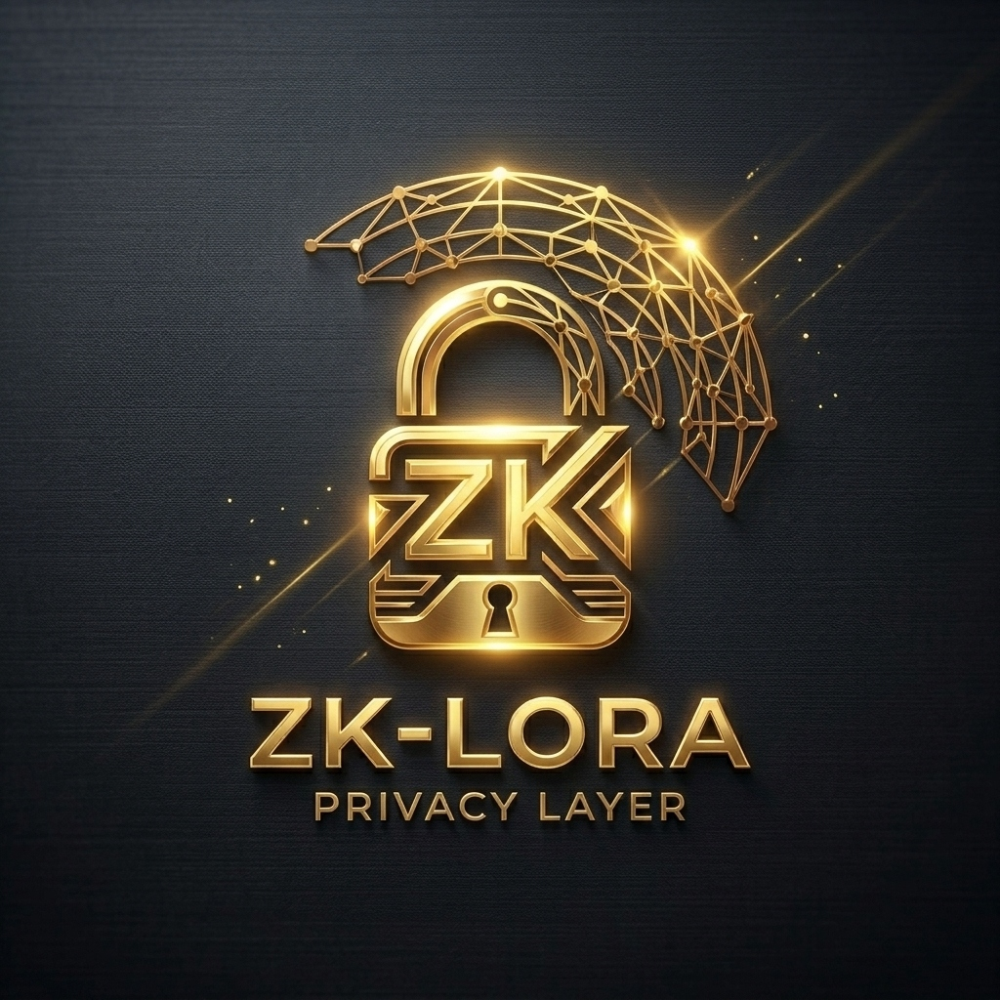

# ZK-LoRa Privacy Layer

*Zero-Knowledge Proofs for Private AI-to-AI Mesh Networks*



### 📖 Download [ZK_LoRa_Whitepaper.pdf](./ZK_LoRa_Whitepaper.pdf) (18-Page PDF)

> *"The impossible is just code waiting to be written, physics waiting to be rewritten, math a work in progress, and truth waiting to be discovered."*

## 🎥 Video Presentation

An official video presentation introducing the ZK-LoRa Privacy Layer is available:

- **Web Platform:** [Watch on Objkt (Tezos NFT #110)](https://objkt.com/tokens/KT1PMD1QSurTyVXxcYDUPAjQt8DNShkBiv4m/110)
- **Direct CDN Stream:** [Direct Video Stream (MP4)](https://assets.objkt.media/file/assets-003/bafybeig2duv7vbxjrww3vmcxkxjqaikyc3hexepauvhuaemepk42v37hji/artifact)
- **Decentralized Storage:** [IPFS Gateway (Filebase)](https://ipfs.filebase.io/ipfs/bafybeig2duv7vbxjrww3vmcxkxjqaikyc3hexepauvhuaemepk42v37hji)

<p align="center">
  <video src="https://assets.objkt.media/file/assets-003/bafybeig2duv7vbxjrww3vmcxkxjqaikyc3hexepauvhuaemepk42v37hji/artifact" poster="https://assets.objkt.media/file/assets-003/bafkreihay7l4wsc5ztv3rbi3mvjsdydw5eiqvuznxvrujlsdtvppnzwefy/artifact" width="100%" controls></video>
</p>

---

## Overview

The ZK-LoRa Privacy Layer adds **zero-knowledge proof authentication** to the Language-U mesh network. Agents prove they are legitimate network participants **without revealing their hardware identity, private keys, or message contents** to eavesdroppers.

This component combines:
1. **Bitcoin-Style Identity** — ECDSA keypairs (secp256k1) → HASH160 → LoRa phone numbers
2. **Groth16-style ZK-SNARKs** — Prove private key knowledge without revealing it
3. **Proof-of-Useful-Work** — Each packet includes computational proof of agent validity
4. **Unlinkable Transmissions** — Fresh ZK proofs per packet prevent traffic analysis
5. **Offline Edge Operations Agent** — Compact offline edge agent serving as a local troubleshooting and operations layer for packet routing, RX/TX diagnosis, concentrator reset guidance, secure packet verification, and shielded payment-reference validation without internet access.

## Files

| File | Purpose |
| :--- | :--- |
| [WHITEPAPER.md](./WHITEPAPER.md) | Full ZK-LoRa Zcash specification with threat model & security analysis |
| [verify_all_proofs.py](./verify_all_proofs.py) | Master orchestrator verifying ZK proofs across 20 programming languages |
| [run_proof.py](./run_proof.py) | ZK-SNARK prover/verifier implementation + CI proof runner |

## Quick Start

```bash
# Run the proof verification (CI mode)
python run_proof.py --test
```

## Security Properties

| Property | Status |
| :--- | :---: |
| Unlinkable transmissions | ✅ |
| Selective disclosure | ✅ |
| Forward secrecy | ✅ |
| Replay protection | ✅ |
| Hardware fingerprint resistance | ✅ |

## License

Conditional Open-Source Grant License — see [LICENSE](./LICENSE)
